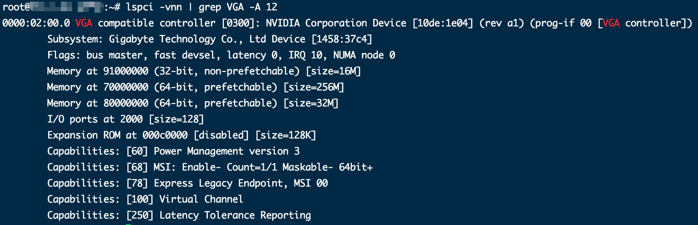
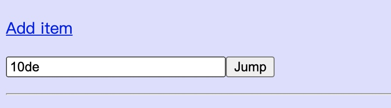
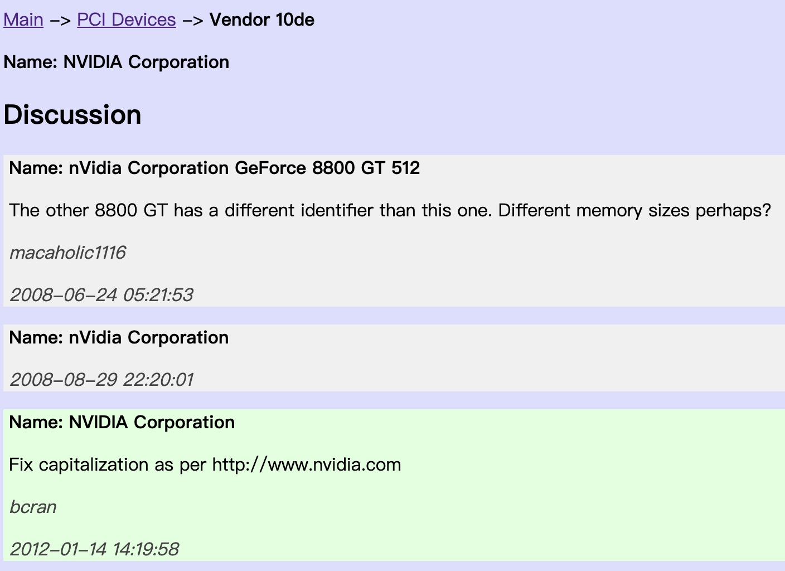
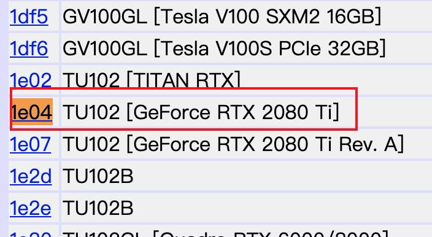

# 1. 查看显卡厂商

```sh
lspci -vnn | grep VGA -A 12
```

我的机器输出如下信息



第一行输出便有硬件厂商、型号名称/序列号和 PCI ID， 大家可以看到上图中所示的 `10de:1e04`，其中冒号前半部分的 10de 表示供应商ID(这里是Nvidia)，后半部分 1e04 表示 PCI ID，用于指示图形单元模型。

此外，大家还可以使用 lshw 命令来获取上述信息：

```sh
sudo lshw -numeric -class video
```

# 查询显卡具体型号

最后显示设备型号为 `[10de:1e04]`，我们可以查询到该显卡的具体信息

- **第一步：查询供应商**

查询地址：http://pci-ids.ucw.cz/read/PC

在最下方输入供应商ID（上图输出结果中第一行中冒号前的字符）



这里显示出我的显卡供应商为NVIDAI




- **第二步：查询显卡PCI ID**

查询地址：接着在上面在查询供应商ID的结果页面

(比如我的Nvidia显卡：http://pci-ids.ucw.cz/read/PC/10de ）

直接<kbd>Ctrl</kbd> + <kbd>F</kbd>搜索自己的PCI ID，或者在最下方输入框里查询

查询到我的显卡具体型号：[GeForce RTX 2080 Ti]


<!-- #endregion -->

<!-- #region -->
# 查看显卡驱动信息

要查看当前 Linux 系统上所使用的显卡驱动名称，同样可以使用 lshw 命令：

```sh
sudo lshw -c video | grep configuration 
```

上图中可以看到输出的显卡驱动名称有两条，其中一条为 driver=i915，我们则可以使用如下命令来检查显卡驱动的详情(另外一条操作类似)

```sh
modinfo i915
```

安装完Nvidia驱动也可通过以下命令查询驱动版本：
```sh
sudo dpkg --list | grep nvidia-*
```

# Nvidia命令行工具nvidia-smi

`nvidia-smi`（The Nvidia System Management Interface）是Nvidia显卡命令行管理套件，基于NVML（Nvidia Management Library）库，旨在管理和监控Nvidia GPU设备。

该套件允许管理员查询GPU设备状态，并且授权系统管理员合适的权限修改GPU设备状态，主要支持Tesla, GRID, Quadro以及TitanX的产品，有限支持其他的GPU产品

nvidia-smi工具支持不同的操作系统，可以将查询信息以XML或人类可读的纯文本格式报告给标准输出或文件。关于nvidia-smi详细使用说明见: 

- http://developer.download.nvidia.com/compute/cuda/6_0/rel/gdk/nvidia-smi.331.38.pdf

- http://developer.download.nvidia.com/compute/DCGM/docs/nvidia-smi-367.38.pdf

使用nvidia-smi query:

- http://nvidia.custhelp.com/app/answers/detail/a_id/3751/~/useful-nvidia-smi-queries


**查看GPU占用动态信息**
```sh
watch -n 10 nvidia-smi
```
或者
```sh
nvidia-smi -l 10
```

上面命令的作用是：每10秒更新GPU信息
<!-- #endregion -->

1. 第一列  GPU：编号0、1 
          Fan：GPU的风扇转速，0~100%

2. 第二列  Name：型号Tesla K20c、Quadro K4000
          Temp： 温度，单位摄氏度。 

3. 第三列  Perf：性能状态，P0~P12，P0表示最大性能，P12表示状态最小性能。 

4. 第四列  Persistence-M：持续模式的状态，持续模式虽然耗能大，但是在新的GPU应用启动时，花费的时间更少，这里显示的是off的状态。
          Pwr：能耗

5. 第五列  Bus-Id： GPU总线，domain:bus:device.function 

6. 第六列  Disp.A：Display Active，表示GPU的显示是否初始化。 
          Memory Usage 显存使用率。 

7. 第七列  Volatile GPU-Util 浮动的GPU利用率。 

8. 第八列   Uncorr. ECC   ECC是“Error Checking and Correcting”的简写，“错误检查和纠正”
        Compute M是计算模式。 
        

显存占用和GPU占用是两个不一样的东西，显卡是由GPU和显存等组成的，显存和GPU的关系有点类似于内存和CPU的关系。


其他常用查询命令：

- [了解GPU从nvidia-smi命令开始](https://blog.csdn.net/csdnofzyk/article/details/80187919)


参考：

- https://developer.nvidia.com/nvidia-system-management-interface
- https://blog.csdn.net/wangleiwavesharp/article/details/71642310?utm_medium=distribute.pc_relevant.none-task-blog-BlogCommendFromMachineLearnPai2-1.add_param_isCf&depth_1-utm_source=distribute.pc_relevant.none-task-blog-BlogCommendFromMachineLearnPai2-1.add_param_isCf

