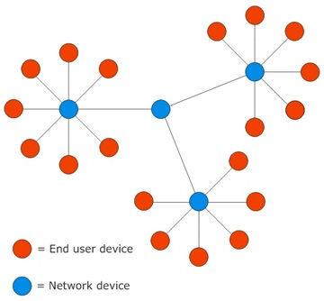

# LoRa

LoRa 的全称是 Long Range (远距离)，是一种低功耗、远距离的局域网无线标准。

## 特点

1. 低功耗：LoRa 采用 Aloha 方法进行通讯，只在节点有数据要发送的时候采取向网络同步数据。
2. 远距离：城镇可达 2-5 Km ， 郊区可达 15 Km
3. 低速率：LoRa 的最高速率只有 37.5Kbps,但这个速率对应的传输距离只有几十米；要支持更远的距离，速率必然降低；通常在 0.3Kbps~11Kbps 之间；(1Kb=1Kbit)

## LoRa 组网

### 点对点

两个 lora 节点直接通信。适合节点较少的场景使用。

### 星型

所有节点都和网关通信，链路简单，开发维护容易。

### mesh

易扩展，消息链路复杂，跳跃转发越多，丢失数据包的机率就越大，可靠性低。