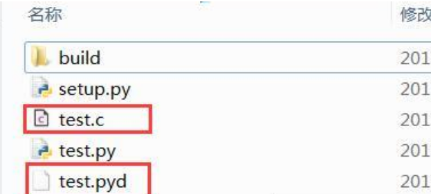
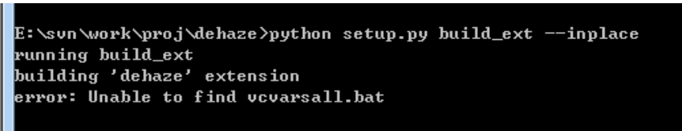
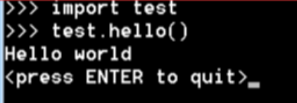
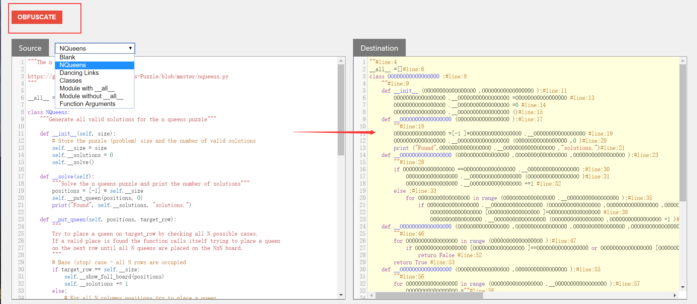

[toc]

## 打包

## Pyinstaller

# 编译

## 编译为 pyc

### 说明

简单来说，pyc 文件就是 Python 的字节码文件，pyc 文件只有在文件被当成模块导入时才会生成。生成 pyc 文件的好处显而易见，当我们多次运行程序时，不需要重新对该模块进行重新的解释。当我们之前有启动项目成功时，python 自动就会创建在每一级有调用到文件的目录一个叫\_\_pycache\_\_的文件夹当成缓存。

.pyc 文件结构介绍参考：<https://www.iteye.com/topic/382423>
.pyc 文件的前 8 个字节含义：

- 四个字节的 magic number
- 四个字节的 timestamp

头四个是 magic number 很多 pyc 都在这个上面做文章，这修改成不合法的，然后你反编译就是败了，你可以找你自己编译成功的 pyc 头直接覆盖掉他的头 8 个字节就可以了， **timestamp 是文件的修改时间，主要是当源码有改变的时候 python 就可以重新生成 pyc 文件.**

### 编译方法

利用`compileall`和`py_compile`来预编译 python 代码：
这两个从某种意义上是互通的，python 预装了这两个东西，

```sh
python -m compileall test.py #把单个.py文件编译为字节码文件
python -m compileall /path/src/ #批量生成字节码文件，/path/src/是包含.py文件名的路径

python -m py_compile test.py #把单个.py文件编译为字节码文件
python -m py_compile /path/src/ #批量生成字节码文件，仅将/path/src/的下一层.py文件编译，不会递归执行
```

上面的 py_compile 针对文件夹是会有一些问题，但理论上这种语法应该是可以的。
可根据项目需要写成编译脚本：

```python
import compileall

compileall.compile_dir('Lib/', force=True)

# Perform same compilation, excluding files in .svn directories.
import re
compileall.compile_dir('Lib/', rx=re.compile(r'[/\\][.]svn'), force=True)

# pathlib.Path objects can also be used.
import pathlib
compileall.compile_dir(pathlib.Path('Lib/'), force=True)
```

对于 compileall 更详细的参数以及命令解析可以参考的链接：<https://docs.python.org/3/library/compileall.html>

```python
import py_compile
def compile(file, cfile=None, dfile=None, doraise=False, optimize=-1,
            invalidation_mode=None):
```

- file: 表示需要编译的 py 文件的路径
- cfile: 表示编译后的 pyc 文件名称和路径，默认为直接在 file 文件名后加 c 或者 o，o 表示优化的字节码
- dfile： 错误消息保存的路径，默认为源文件名
- doraise: 如果为 `True`，编译发生错误时则会引发一个 PyCompileError； 如果为`False`, 编译文件出错时，则会有输出一个错误信息，而不会引发异常
- optimize: 编译优化等级，可取-1, 0, 1, 2. 值-1 表示使用当前解释器的优化等级，其他值由-O 指定。

### 使用

as

## 编译为 pyo 或者 opt-n.pyc 文件

### 说明

源代码文件经过优化编译后生成的文件，无法用文本编辑器进行编辑
Python3.5 之后，不再使用.pyo 文件名，而是使用类似“xxx.opt-n.pyc 的文件名；
编译成 pyc 和 pyo 本质上和 py 没有太大区别，只是对于这个模块的加载速度提高了，并没有提高代码的执行速度。

### 编译方法

pyo 文件其实很简单，就是上面 pyc 命令的改版：

```sh
python -O -m py_compile file.py
python -O -m py_compile /path/src/
python -O -m compileall file.py
python -O -m compileall /path/src/

或者
python -OO -m py_compile file.py
python -OO -m py_compile /path/src/
python -OO -m compileall file.py
python -OO -m compileall /path/src/
```

### 运行

## 编译成 pyd 或 so 链接库

### 编译方法

利用 Cython 模块，根据编译环境不同生成不同文件。

- 前提

```sh
pip intall Cython
```

- 编辑一个 setup.py 文件，写入以下代码并运行

**注意**：程序所在的目录路径不能包含中文文字

```python

# 脚本文件
from distutils.core import setup
from Cython.Build import cythonize

setup(
  name = 'Hello world app',
  ext_modules = cythonize("test.py"),
)
```

然后我们就退回到目录下运行命令，就会在 windows 上生成 pyd 文件，或者 linux 上生成 so 文件：

```sh
python setup.py build_ext --inplace
```

最终生成如下文件：


可能会出现“Unable to find vcvarsall.bat”错误

参考这里[How to deal with the pain of “unable to find vcvarsall.bat”](https://blogs.msdn.microsoft.com/pythonengineering/2016/04/11/unable-to-find-vcvarsall-bat/#comments)

### 使用

可以通过`import test`使用该文件



# 反编译

## pyc 文件反编译

1. 在线网站：https://tool.lu/pyc/ （效果好像不太好）

2. uncompyle6

   - 安装

   ```sh
   pip install uncompyle6
   ```

   - 使用
     将 models.pyc 反编译成 py 文件

   ```sh
    uncompyle6 models.pyc > models.py
   ```

   将当前文件夹中所有的 \.pyc 文件反编译成后缀名为 \.py 的源文件

   ```sh
   uncompile -o . *.pyc
   ```

   反编译后的效果可以说很理想，如果你的代码格式符合 PEP8 规范的要求，那就基本和源来的文件一样，不过各种注释就没有了。

   查看更多用法：

   > uncompyle6 --help

   ```sh

   Usage:
   uncompyle6 [OPTIONS]... [ FILE | DIR]...
   uncompyle6 [--help | -h | --V | --version]

   Examples:
   uncompyle6      foo.pyc bar.pyc       # decompile foo.pyc, bar.pyc to stdout
   uncompyle6 -o . foo.pyc bar.pyc       # decompile to ./foo.pyc_dis and ./bar.pyc_dis
   uncompyle6 -o /tmp /usr/lib/python1.5 # decompile whole library

   Options:
   -o <path>     output decompiled files to this path:
                   if multiple input files are decompiled, the common prefix
                   is stripped from these names and the remainder appended to
                   <path>
                   uncompyle6 -o /tmp bla/fasel.pyc bla/foo.pyc
                       -> /tmp/fasel.pyc_dis, /tmp/foo.pyc_dis
                   uncompyle6 -o /tmp bla/fasel.pyc bar/foo.pyc
                       -> /tmp/bla/fasel.pyc_dis, /tmp/bar/foo.pyc_dis
                   uncompyle6 -o /tmp /usr/lib/python1.5
                       -> /tmp/smtplib.pyc_dis ... /tmp/lib-tk/FixTk.pyc_dis
   --compile | -c <python-file>
                   attempts a decompilation after compiling <python-file>
   -d            print timestamps
   -p <integer>  use <integer> number of processes
   -r            recurse directories looking for .pyc and .pyo files
   --fragments   use fragments deparser
   --verify      compare generated source with input byte-code
   --verify-run  compile generated source, run it and check exit code
   --syntax-verify compile generated source
   --linemaps    generated line number correspondencies between byte-code
                   and generated source output
   --encoding  <encoding>
                   use <encoding> in generated source according to pep-0263
   --help        show this message

   Debugging Options:
   --asm     | -a        include byte-code       (disables --verify)
   --grammar | -g        show matching grammar
   --tree={before|after}
   -t {before|after}     include syntax before (or after) tree transformation
                           (disables --verify)
   --tree++ | -T         add template rules to --tree=before when possible

   Extensions of generated files:
   '.pyc_dis' '.pyo_dis'   successfully decompiled (and verified if --verify)
       + '_unverified'       successfully decompile but --verify failed
       + '_failed'           decompile failed (contact author for enhancement)
   ```

3. 其他库 uncompyle2， decompyle2, DePython, unpyc, uncompyle, pycdc

# 混淆加密

## 混淆

### 1. 在线网站：<http://pyob.oxyry.com/>

#### 使用方法

下拉菜单选择混淆方式，还有底部的选项，将代码填到左侧文本框，点击上方红色按钮，即可生成。


#### 说明

此方式仅仅是将变量替换为 O 、0 组合的字符串，让人难以直接阅读，但是导入的包名没变，将这些 0O 组合的变量名做简单替换，再通过 debug 等方式还是能了解代码的整体运行流程的。

可以再配合其他加密方式，增加破解难度，哈哈。

这个混淆算法也可以自己实现。QAQ

### 加密

#### 定制 python 解释器


参考:

- https://blog.csdn.net/submarineas/article/details/93723421#_170

- https://blog.csdn.net/Gavinmiaoc/article/details/84340736

