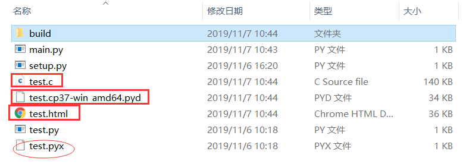

[toc]

# 一、编译

提示：编译过程中所有文件路径最好不要出现中文

## 1. 编译为 pyc

### 说明

简单来说，pyc 文件就是 Python 的字节码文件，pyc 文件只有在文件被当成模块导入时才会生成。生成 pyc 文件的好处显而易见，当我们多次运行程序时，不需要重新对该模块进行重新的解释。当我们之前有启动项目成功时，python 自动就会创建在每一级有调用到文件的目录一个叫\_\_pycache\_\_的文件夹当成缓存。

.pyc 文件结构介绍参考：<https://www.iteye.com/topic/382423>
.pyc 文件的前 8 个字节含义：

- 四个字节的 magic number
- 四个字节的 timestamp

头四个是 magic number 很多 pyc 都在这个上面做文章，这修改成不合法的，然后你反编译就是败了，你可以找你自己编译成功的 pyc 头直接覆盖掉他的头 8 个字节就可以了， **timestamp 是文件的修改时间，主要是当源码有改变的时候 python 就可以重新生成 pyc 文件.**

### 编译方法

利用`compileall`和`py_compile`来预编译 python 代码：
这两个从某种意义上是互通的，python 预装了这两个东西，

```sh
python -m compileall test.py #把单个.py文件编译为字节码文件
python -m compileall /path/src/ #批量生成字节码文件，/path/src/是包含.py文件名的路径

python -m py_compile test.py #把单个.py文件编译为字节码文件
python -m py_compile /path/src/ #批量生成字节码文件，仅将/path/src/的下一层.py文件编译，不会递归执行
```

上面的 py_compile 针对文件夹是会有一些问题，但理论上这种语法应该是可以的。
可根据项目需要写成编译脚本：

```python
import compileall

compileall.compile_dir('Lib/', force=True)

# Perform same compilation, excluding files in .svn directories.
import re
compileall.compile_dir('Lib/', rx=re.compile(r'[/\\][.]svn'), force=True)

# pathlib.Path objects can also be used.
import pathlib
compileall.compile_dir(pathlib.Path('Lib/'), force=True)
```

对于 compileall 更详细的参数以及命令解析可以参考的链接：<https://docs.python.org/3/library/compileall.html>

```python
import py_compile
def compile(file, cfile=None, dfile=None, doraise=False, optimize=-1,
            invalidation_mode=None):
```

- file: 表示需要编译的 py 文件的路径
- cfile: 表示编译后的 pyc 文件名称和路径，默认为直接在 file 文件名后加 c 或者 o，o 表示优化的字节码
- dfile： 错误消息保存的路径，默认为源文件名
- doraise: 如果为 `True`，编译发生错误时则会引发一个 PyCompileError； 如果为`False`, 编译文件出错时，则会有输出一个错误信息，而不会引发异常
- optimize: 编译优化等级，可取-1, 0, 1, 2. 值-1 表示使用当前解释器的优化等级，其他值由-O 指定。

### 使用

最好将文件名中间类似 cpython-36 的部分去掉，否则可能出现导包错误 ModuleNotFoundError:

## 2. 编译为 pyo 或者 opt-n.pyc 文件

### 说明

源代码文件经过优化编译后生成的文件，无法用文本编辑器进行编辑
Python3.5 之后，不再使用.pyo 文件名，而是使用类似“xxx.opt-n.pyc 的文件名；
编译成 pyc 和 pyo 本质上和 py 没有太大区别，只是对于这个模块的加载速度提高了，并没有提高代码的执行速度。

### 编译方法

pyo 文件其实很简单，就是上面 pyc 命令的改版：

```sh
python -O -m py_compile file.py
python -O -m py_compile /path/src/
python -O -m compileall file.py
python -O -m compileall /path/src/

或者
python -OO -m py_compile file.py
python -OO -m py_compile /path/src/
python -OO -m compileall file.py
python -OO -m compileall /path/src/
```

### 运行

等等等等

## 3. 编译成 pyd 或 so 链接库

### 说明

pyd 格式是 D 语言(C/C++综合进化版本)生成的二进制文件
windows 编译环境鄙人用的 Visual Studio 2019

### 编译方法一

#### Cython

利用 Cython 模块，根据编译环境不同生成不同文件。

- 前提安装 Cython

```sh
pip intall Cython
```

- 编辑一个 setup.py 文件，写入以下代码并运行

**注意**：程序所在的目录路径不能包含中文文字

```python

# 脚本文件
from distutils.core import setup
from Cython.Build import cythonize

setup(
  name = 'Hello world app',
  ext_modules = cythonize("test.py"),
)
```

然后我们就退回到目录下运行命令，就会在 windows 上生成 pyd 文件，或者 linux 上生成 so 文件：

```sh
python setup.py build_ext --inplace
```

**--inplace 的意思是在当前文件目录下生成.pyd 文件，不加这一句就会在 build 文件夹中生成**

最终生成如下文件：

其中，build 是生成过程使用到的临时文件。test.c 也是临时文件
注：可能会出现“Unable to find vcvarsall.bat”错误

参考这里

- [修改 Python 安装目录的文件设置](http://www.cnblogs.com/lazyboy/p/4017567.html)
- [How to deal with the pain of “unable to find vcvarsall.bat”](https://blogs.msdn.microsoft.com/pythonengineering/2016/04/11/unable-to-find-vcvarsall-bat/#comments)

### 编译方法二

#### 安装 easycython

这个最方便只要一行代码就可以搞定。
<https://github.com/cjrh/easycython>

```sh
pip install easycython
```

这个模块也会自动安装依赖的 cython

#### 转换步骤

将 \.py 文件重命名为.pyx
运行命令

```sh
easycython *.pyx
```

上面会将当前文件夹下所有的.pyx 文件生成为.pyd (Linux 下是\.so)



html 文件可以查看 .py 文件与 .c 文件的转换对照关系。


### 使用建议

**同样的，最好重命名 pyd 文件名，将中间的部分删除，前后部分不要动**
可以通过`import test`使用该文件


**个人建议**：将核心的代码编译为 pyd 或者 so 文件，然后再写一个简单的 main.py 去 import 调用这些链接库文件，达到隐藏核心代码的作用。

另外，cython 在 jupyter notebook 里使用真的很刺激 😱😱

关于 cython 与 python 混合编程的使用可以参考：

- <http://docs.cython.org/en/latest/src/quickstart/overview.html>
- <https://blog.csdn.net/g6uqwseseo/article/details/71439453?locationNum=11&fps=1>

# 二、打包

各种打包工具的对比如下(来自文章[Freezing Your Code](http://docs.python-guide.org/en/latest/shipping/freezing/))

| Solution    | Windows | Linux | OS X | Python 3 | License | One-file mode | Zipfile import | Eggs | pkg_resources support |
| ----------- | ------- | ----- | ---- | -------- | ------- | ------------- | -------------- | ---- | --------------------- |
| bbFreeze    | yes     | yes   | yes  | no       | MIT     | no            | yes            | yes  | yes                   |
| py2exe      | yes     | no    | no   | yes      | MIT     | yes           | yes            | no   | no                    |
| pyInstaller | yes     | yes   | yes  | no       | GPL     | yes           | no             | yes  | no                    |
| cx_Freeze   | yes     | yes   | yes  | yes      | PSF     | no            | yes            | yes  | no                    |
| py2app      | no      | no    | yes  | yes      | MIT     | no            | yes            | yes  | yes                   |

其中 **pyInstaller** 和 **cx_Freeze** 都是不错的，stackoverflow 上也有人建议用 cx_Freeze，说是更便捷些。pkg_resources 新版的 pyInstaller 貌似是支持的。

[PyInstaller 官方 WIKI](http://pythonhosted.org/PyInstaller)

PyInstaller 的原理简介
PyInstaller 其实就是把 python 解析器和你自己的脚本打包成一个可执行的文件，和编译成真正的机器码完全是两回事，所以千万不要指望成打包成一个可执行文件会提高运行效率，相反可能会降低运行效率，好处就是在运行者的机器上不用安装 python 和你的脚本依赖的库。在 Linux 操作系统下，它主要用的 binutil 工具包里面的 ldd 和 objdump 命令。

PyInstaller 输入你指定的的脚本，首先分析脚本所依赖的其他脚本，然后去查找，复制，把所有相关的脚本收集起来，包括 Python 解析器，然后把这些文件放在一个目录下，或者打包进一个可执行文件里面。

可以直接发布输出的整个文件夹里面的文件，或者生成的可执行文件。你只需要告诉用户，你的应用 App 是自我包含的，不需要安装其他包，或某个版本的 Python，就可以直接运行了。

**需要注意的是，PyInstaller 打包的执行文件，只能在和打包机器系统同样的环境下。也就是说，不具备可移植性，若需要在不同系统上运行，就必须针对该平台进行打包。**

# 三、反编译

## 1. pyc 文件反编译

1. 在线网站：<https://tool.lu/pyc/> （效果好像不太好）

2. uncompyle6

   - 安装

   ```sh
   pip install uncompyle6
   ```

   - 使用
     将 models.pyc 反编译成 py 文件

   ```sh
    uncompyle6 models.pyc > models.py
   ```

   将当前文件夹中所有的 \.pyc 文件反编译成后缀名为 \.py 的源文件

   ```sh
   uncompile -o . *.pyc
   ```

   反编译后的效果可以说很理想，如果你的代码格式符合 PEP8 规范的要求，那就基本和源来的文件一样，不过各种注释就没有了。

   查看更多用法：

   > uncompyle6 --help

   ```sh

   Usage:
   uncompyle6 [OPTIONS]... [ FILE | DIR]...
   uncompyle6 [--help | -h | --V | --version]

   Examples:
   uncompyle6      foo.pyc bar.pyc       # decompile foo.pyc, bar.pyc to stdout
   uncompyle6 -o . foo.pyc bar.pyc       # decompile to ./foo.pyc_dis and ./bar.pyc_dis
   uncompyle6 -o /tmp /usr/lib/python1.5 # decompile whole library

   Options:
   -o <path>     output decompiled files to this path:
                   if multiple input files are decompiled, the common prefix
                   is stripped from these names and the remainder appended to
                   <path>
                   uncompyle6 -o /tmp bla/fasel.pyc bla/foo.pyc
                       -> /tmp/fasel.pyc_dis, /tmp/foo.pyc_dis
                   uncompyle6 -o /tmp bla/fasel.pyc bar/foo.pyc
                       -> /tmp/bla/fasel.pyc_dis, /tmp/bar/foo.pyc_dis
                   uncompyle6 -o /tmp /usr/lib/python1.5
                       -> /tmp/smtplib.pyc_dis ... /tmp/lib-tk/FixTk.pyc_dis
   --compile | -c <python-file>
                   attempts a decompilation after compiling <python-file>
   -d            print timestamps
   -p <integer>  use <integer> number of processes
   -r            recurse directories looking for .pyc and .pyo files
   --fragments   use fragments deparser
   --verify      compare generated source with input byte-code
   --verify-run  compile generated source, run it and check exit code
   --syntax-verify compile generated source
   --linemaps    generated line number correspondencies between byte-code
                   and generated source output
   --encoding  <encoding>
                   use <encoding> in generated source according to pep-0263
   --help        show this message

   Debugging Options:
   --asm     | -a        include byte-code       (disables --verify)
   --grammar | -g        show matching grammar
   --tree={before|after}
   -t {before|after}     include syntax before (or after) tree transformation
                           (disables --verify)
   --tree++ | -T         add template rules to --tree=before when possible

   Extensions of generated files:
   '.pyc_dis' '.pyo_dis'   successfully decompiled (and verified if --verify)
       + '_unverified'       successfully decompile but --verify failed
       + '_failed'           decompile failed (contact author for enhancement)
   ```

3. 其他库 uncompyle2， decompyle2, DePython, unpyc, uncompyle, pycdc

## exe 反编译

针对 pyinstaller 打包的程序破解：

---

# 四、混淆加密

参考文章：

- [如何保护你的 Python 代码 （一）—— 现有加密方案](https://zhuanlan.zhihu.com/p/54296517)

- [python 代码混淆工具汇总](https://www.cnblogs.com/bonelee/p/8603284.html)

## 1. 代码混淆

如果代码被混淆到一定程度，连作者看着都费劲的话，是不是也能达到保护源码的目的呢？

既然我们的目的是混淆，就是通过一系列的转换，让代码逐渐不让人那么容易明白，那就可以这样下手：

- 移除注释和文档。没有这些说明，在一些关键逻辑上就没那么容易明白了。
- 改变缩进。完美的缩进看着才舒服，如果缩进忽长忽短，看着也一定闹心。
- 在 tokens 中间加入一定空格。这就和改变缩进的效果差不多。
- 重命名函数、类、变量。命名直接影响了可读性，乱七八糟的名字可是阅读理解的一大障碍。
- 在空白行插入无效代码。这就是障眼法，用无关代码来打乱阅读节奏。

### 1.1 在线网站：<http://pyob.oxyry.com/>

#### 使用方法

下拉菜单选择混淆方式，还有底部的选项，将代码填到左侧文本框，点击上方红色按钮，即可生成。


#### 说明

此方式仅仅是将变量替换为 O 、0 组合的字符串，让人难以直接阅读，但是代码结构以及导入的包名没变，将这些 0O 组合的变量名做简单替换，再通过 debug 等方式还是能了解代码的整体运行流程的。

可以再配合其他加密方式，增加破解难度，哈哈。

这个混淆算法也可以自己实现。QAQ

### 1.2 Intensio-Obfuscator

Intensio-Obfuscator 可以直接将 Python 源代码进行转换，并输出经过混淆处理后的 Python 代码。它会自动将变量名、类名以及函数名替换为随机字符，并定义长度，移除注释内容，自动换行，并给每一行代码增加随机脚本（所有的随机值都是不同的）。

支持的 Python 文件代码版本为 v2.x 以及 v3.x 版本.

[Github 地址](https://github.com/Hnfull/Intensio-Obfuscator)

#### 功能介绍

- 替换：替换所有的变量名、类名以及函数名，移除所有的换行符
- 填充：在每一行代码后添加随机脚本，并移除所有的换行符
- 移除：移除代码中的全部注释以及换行
- 低级混淆：生成 32 个字符的随机字符串，替换源代码中定义的变量名、类名以及函数名
- 中级混淆：生成 64 个字符的随机字符串，替换源代码中定义的变量名、类名以及函数名
- 高级混淆：生成 128 个字符的随机字符串，替换源代码中定义的变量名、类名以及函数名

#### 工具使用

```sh
git clone https://github.com/Hnfull/Intensio-Obfuscator.git
pip3 install -r Intensio-Obfuscator/requirements.txt
cd Intensio-Obfuscator/intensio/

python intensio_obfuscator.py --help
```

| 参数               | 描述                                                                              |
| ------------------ | --------------------------------------------------------------------------------- |
| -h, –help          | 显示帮助菜单                                                                      |
| -f, –onefile       | 指定一个代码文件                                                                  |
| -d, –multiplefiles | 指定多个代码文件（项目）                                                          |
| -i, –input         | 源文件或目录                                                                      |
| -c, –code          | 输入文件或目录中使用的语言，默认值为[python]                                      |
| -o, –output        | 混淆处理后的输出文件或目录                                                        |
| -m, –mixer         | 输出变量混淆的字符数量/长度，默认值为: [medium]，可选项为： [lower, medium, high] |
| -r, –replace       | 激活“替换”混淆功能                                                                |
| -p, –padding       | 激活“填充”混淆功能                                                                |
| -rm, –remove       | 激活“移除”混淆功能                                                                |

#### 工具使用样例

> python3.xintensio_obfuscator.py -d -i test/python/multiplefiles/basic/input/basicRAT -cpython -o test/python/multiplefiles/basic/output/basicRAT -m lower -r –rm

> python3.xintensio_obfuscator.py -d -i test/python/multiplefiles/advanced/input/basicRAT-c python -o test/python/multiplefiles/advanced/output/basicRAT -m high -r -p-rm

### 1.3 pyminifier

对代码压缩、混淆等
[Github](https://github.com/liftoff/pyminifier)
[官方文档](http://liftoff.github.io/pyminifier/)

### 1.4 Opy

[Github](https://github.com/QQuick/Opy)
OPY - Obfuscator for Python, string obfuscation added

### 1.5 pyobfuscate

[pyobfuscate](https://github.com/astrand/pyobfuscate) 算是一个颇具年头的 Python 代码混淆库了，但却是“老当益壮”了。
(一次只能混淆一个文件，好像只能用于 python 2)

```sh
git clone https://github.com/astrand/pyobfuscate.git
cd pyobfuscate/
python setup.py install
# 使用
pyobfuscate example.py
```

---

## 2.加密

### 定制 python 解释器

从源码下手：https://github.com/python/cpython/tree/3.6/Modules

假定我们有一个算法，能够加密原始的 Python 代码，这些加密后代码随发行程序一起，可被任何人看到，却难以破解。另一方面，有一个定制好的 Python 解释器，它能够解密这些被加密的代码，然后解释执行。而由于 Python 解释器本身是二进制文件，人们也就无法从解释器中获取解密的关键数据。从而达到了保护源码的目的。

要实现上述的设想，首先需要掌握基本的加解密算法，其次探究 Python 执行代码的方式从而了解在何处进行加解密，最后禁用字节码用以防止通过 .pyc 反编译。

---

参考文章:

- [B 乎-使用 python 语言如何保密源代码以防止逆向工程？](https://www.zhihu.com/question/20069661)

- <https://docs.python.org/3/library>

- <https://blog.csdn.net/submarineas/article/details/93723421#_170>

- <https://blog.csdn.net/Gavinmiaoc/article/details/84340736>

- <https://blog.csdn.net/qq_34106574/article/details/81166062>

- <https://zhuanlan.zhihu.com/p/54296517>

- <https://www.freebuf.com/sectool/205926.html>

- <https://blog.csdn.net/kwame211/article/details/79202074>

- [python 转 c++工具 shedskin](https://blog.csdn.net/mangobar/article/details/81215019)

- [如何保护你的 Python 代码 （一）—— 现有加密方案](https://zhuanlan.zhihu.com/p/54296517)

- [如何保护你的 Python 代码 （二）—— 定制 Python 解释器](https://zhuanlan.zhihu.com/p/54297880)
