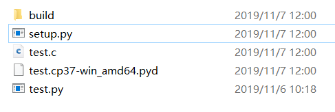
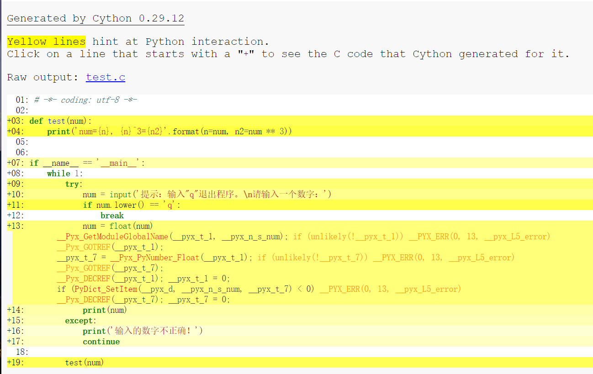
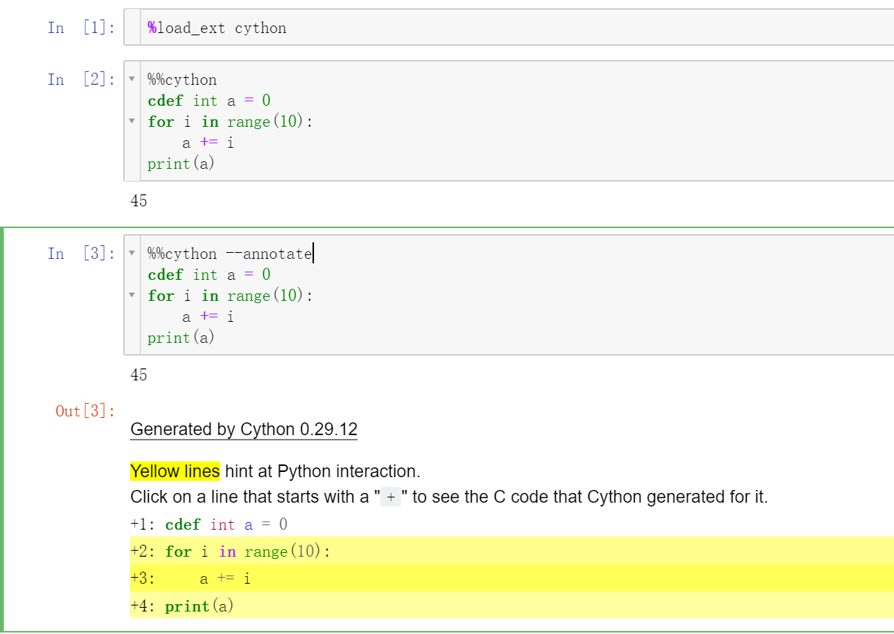

[toc]

# 一、编译

提示：编译过程中所有文件路径最好不要出现中文

## 1. 编译为 pyc

### 说明

- pyc 是由 py 文件经过编译后生成的二进制字节码（byte code）文件；
- pyc 文件的加载速度比 py 文件快；
- pyc 文件是一种跨平台的字节码，由 python 的虚拟机来执行；
- pyc 文件的内容跟 python 版本相关，不同的 python 版本编译生成不同的 pyc 文件，只能在相同版本环境下执行；
- .pyc 文件结构介绍参考：<https://www.iteye.com/topic/382423>、<https://yq.aliyun.com/articles/599833#>
  .pyc 文件的前 8 个字节含义：

      - 四个字节的 magic number
      - 四个字节的 timestamp

  头四个是 magic number 很多 pyc 都在这个上面做文章，这修改成不合法的，然后你反编译就是败了，你可以找你自己编译成功的 pyc 头直接覆盖掉他的头 8 个字节就可以了， **timestamp 是文件的修改时间，主要是当源码有改变的时候 python 就可以重新生成 pyc 文件.**

### 编译方法

利用`compileall`和`py_compile`来预编译 python 代码：
这两个从某种意义上是互通的，python 预装了这两个东西，

```sh
python -m compileall test.py #把单个.py文件编译为字节码文件
python -m compileall /path/src/ #批量生成字节码文件，/path/src/是包含.py文件名的路径

python -m py_compile test.py #把单个.py文件编译为字节码文件
python -m py_compile /path/src/ #批量生成字节码文件，仅将/path/src/的下一层.py文件编译，不会递归执行
```

上面的 py_compile 针对文件夹是会有一些问题，但理论上这种语法应该是可以的。

可根据项目需要写成编译脚本：

- compileall

对于 compileall 更详细的参数以及命令解析可以参考的链接：<https://docs.python.org/3/library/compileall.html>

```python
import compileall

# compileall.compile_file编译单个文件；
compileall.compile_file('main.py')

#compile_dir 函数编译文件夹下的py文件
compileall.compile_dir('Lib/', force=True)

# 使用多处理器编译
compileall.compile_dir('Lib/', workers=2)

# Perform same compilation, excluding files in .svn directories.
import re
compileall.compile_dir('Lib/', rx=re.compile(r'[/\\][.]svn'), force=True)

# pathlib.Path objects can also be used.
import pathlib
compileall.compile_dir(pathlib.Path('Lib/'), force=True)
```

- py_compile

函数原型：

> py_compile.compile(file, cfile=None, dfile=None, doraise=False, optimize=-1, invalidation_mode=None):

- file: 表示需要编译的 py 文件的路径
- cfile: 表示编译后的 pyc 文件名称和路径，默认为直接在 file 文件名后加 c 或者 o，o 表示优化的字节码
- dfile： 错误消息保存的路径，默认为源文件名
- doraise: 如果为 `True`，编译发生错误时则会引发一个 PyCompileError； 如果为`False`, 编译文件出错时，则会有输出一个错误信息，而不会引发异常
- optimize: 编译优化等级，可取-1, 0, 1, 2. 值-1 表示使用当前解释器的优化等级，就像命令行参数-O 的个数。

```python
import py_compile

py_compile.compile(r'Downloads/md5.py')
'Downloads/__pycache__/md5.cpython-37.pyc'
```

### 使用

与 py 文件一样使用，最好将文件名中间类似 cpython-36 的部分去掉，否则可能出现导包错误 ModuleNotFoundError:

## 2. 编译为 pyo 或者 opt-n.pyc 文件

### 说明

源代码文件经过优化编译后生成的文件，无法用文本编辑器进行编辑
Python3.5 之后，不再使用.pyo 文件名，而是使用类似“xxx.opt-n.pyc 的文件名；
编译成 pyc 和 pyo 本质上和 py 没有太大区别，只是对于这个模块的加载速度提高了，并没有提高代码的执行速度。

### 编译方法

pyo 文件其实很简单，就是上面 pyc 命令的改版：

```sh
python -O -m py_compile file.py
python -O -m py_compile /path/src/
python -O -m compileall file.py
python -O -m compileall /path/src/

或者
python -OO -m py_compile file.py
python -OO -m py_compile /path/src/
python -OO -m compileall file.py
python -OO -m compileall /path/src/
```

### 运行

与 py 文件一样运行、导入

```sh
python sample.cpython-36.pyo
```

```py
from sample import *
```

## 3. 编译成 pyd 或 so 链接库

### 说明

pyd 格式是 D 语言(C/C++综合进化版本)生成的二进制文件，是 python 的动态链接库；
参考信息：https://docs.python.org/3/faq/windows.html?highlight=pyd#is-a-pyd-file-the-same-as-a-dll

windows 编译环境鄙人用的 Visual Studio 2019

### 编译方法一

#### Cython

利用 Cython 模块，根据编译环境不同生成不同文件。

- 前提安装 Cython

```sh
pip intall Cython
```

- 编辑一个 setup.py 文件，写入以下代码并运行

**注意**：程序所在的目录路径不能包含中文文字

```python

# 脚本文件
from distutils.core import setup
from Cython.Build import cythonize

setup(
  name = 'Hello world app',
  ext_modules = cythonize("test.py"),
)
```

然后我们就退回到目录下运行命令，就会在 windows 上生成 pyd 文件，或者 linux 上生成 so 文件：

```sh
python setup.py build_ext --inplace
```

- build_ext 是指明 python 生成 C/C++的扩展模块(build C/C++ extensions
- --inplace 的意思是在当前文件目录下生成.pyd 文件，不加这一句就会在 build 文件夹中生成

最终生成如下文件：

其中，build 是生成过程使用到的临时文件。test.c 也是临时文件
注：可能会出现“Unable to find vcvarsall.bat”错误


参考这里

- [修改 Python 安装目录的文件设置](http://www.cnblogs.com/lazyboy/p/4017567.html)
- [How to deal with the pain of “unable to find vcvarsall.bat”](https://blogs.msdn.microsoft.com/pythonengineering/2016/04/11/unable-to-find-vcvarsall-bat/#comments)

附：编译选定文件夹下所有 py 文件脚本

```py
import os
import re
import shutil
from distutils.core import Extension, setup

from Cython.Build import cythonize
from Cython.Compiler import Options

# __file__ 含有魔术变量的应当排除，Cython虽有个编译参数，但只能设置静态。
exclude_so = ['__init__.py']
sources = ['.']    # 选定文件夹

extensions = []
for source in sources:
    # 递归遍历文件夹（深度优先）
    for dirpath, foldernames, filenames in os.walk(source):
        # 删除pyc文件
        if '__pycache__' in foldernames:
            foldernames.remove('__pycache__')
            shutil.rmtree(os.path.join(dirpath, '__pycache__'))
        for filename in filter(lambda x: re.match(r'.*[.]py$', x), filenames):
            file_path = os.path.join(dirpath, filename)
            print(file_path, end='\t')
            if filename not in exclude_so:
                temp = re.sub(r'[/\\]', '.', file_path[:-3]).strip('.')
                print(temp)
                extensions.append(
                    Extension(temp, [file_path], extra_compile_args=["-Os", "-g0"],
                              extra_link_args=["-Wl,--strip-all"]))
Options.docstrings = False
compiler_directives = {'optimize.unpack_method_calls': False}
setup(
    # cythonize的exclude全路径匹配，不灵活，不如在上一步排除。
    # language_level是python的主版本号
    ext_modules=cythonize(extensions, exclude=None, nthreads=20, quiet=True, build_dir='./build',
                          language_level=3, compiler_directives=compiler_directives))
```

### 编译方法二

#### 安装 easycython

这个最方便只要一行代码就可以搞定。
<https://github.com/cjrh/easycython>

```sh
pip install easycython
```

这个模块也会自动安装依赖的 cython

#### 转换步骤

将 \.py 文件重命名为.pyx
运行命令

```sh
easycython *.pyx
```

上面会将当前文件夹下所有的.pyx 文件生成为.pyd (Linux 下是\.so)


html 文件可以查看 .py 文件与 .c 文件的转换对照关系。


### 编译方法三：Nuitka

100%兼容标准 python2/python3，静态编译你的 python 程序

### 使用建议

**同样的，最好重命名 pyd 文件名，将中间的部分删除，前后部分不要动**
可以通过`import test`使用该文件


**个人建议**：将核心的代码编译为 pyd 或者 so 文件，然后再写一个简单的 main.py 去 import 调用这些链接库文件，达到隐藏核心代码的作用。

另外，cython 在 jupyter notebook 里使用真的很刺激 😱😱

关于 cython 与 python 混合编程的使用可以参考：

- <http://docs.cython.org/en/latest/src/quickstart/overview.html>
- <https://blog.csdn.net/g6uqwseseo/article/details/71439453?locationNum=11&fps=1>

---

# 二、打包

各种打包工具的对比如下(来自文章[Freezing Your Code](http://docs.python-guide.org/en/latest/shipping/freezing/))

| Solution    | Windows | Linux | OS X | Python 3 | License | One-file mode | Zipfile import | Eggs | pkg_resources support |
| ----------- | ------- | ----- | ---- | -------- | ------- | ------------- | -------------- | ---- | --------------------- |
| bbFreeze    | yes     | yes   | yes  | no       | MIT     | no            | yes            | yes  | yes                   |
| py2exe      | yes     | no    | no   | yes      | MIT     | yes           | yes            | no   | no                    |
| pyInstaller | yes     | yes   | yes  | no       | GPL     | yes           | no             | yes  | no                    |
| cx_Freeze   | yes     | yes   | yes  | yes      | PSF     | no            | yes            | yes  | no                    |
| py2app      | no      | no    | yes  | yes      | MIT     | no            | yes            | yes  | yes                   |

其中 **pyInstaller** 和 **cx_Freeze** 都是不错的，stackoverflow 上也有人建议用 cx_Freeze，说是更便捷些。pkg_resources 新版的 pyInstaller 貌似是支持的。

## 1. PyInstaller

### 说明

[官方 WIKI](http://pythonhosted.org/PyInstaller)

PyInstaller 的原理简介
PyInstaller 其实就是把 python 解析器和你自己的脚本打包成一个可执行的文件，和编译成真正的机器码完全是两回事，所以千万不要指望成打包成一个可执行文件会提高运行效率，相反可能会降低运行效率，好处就是在运行者的机器上不用安装 python 和你的脚本依赖的库。在 Linux 操作系统下，它主要用的 binutil 工具包里面的 ldd 和 objdump 命令。

PyInstaller 输入你指定的的脚本，首先分析脚本所依赖的其他脚本，然后去查找，复制，把所有相关的脚本收集起来，包括 Python 解析器，然后把这些文件放在一个目录下，或者打包进一个可执行文件里面。

### 使用方法

1. 安装

   ```sh
   pip install pyinstaller
   ```

2. PyInstaller 支持的常用选项

   - -h，--help 查看该模块的帮助信息
   - -F，-onefile 产生单个的可执行文件
   - -D，--onedir 产生一个目录（包含多个文件）作为可执行程序
   - -w，--windowed，--noconsolc 指定程序运行时不显示命令行窗口（仅对 Windows 有效）

   - -a，--ascii 不包含 Unicode 字符集支持
   - -d，--debug 产生 debug 版本的可执行文件
   - -c，--nowindowed，--console 指定使用命令行窗口运行程序（仅对 Windows 有效）
   - -o DIR，--out=DIR 指定 spec 文件的生成目录。如果没有指定，则默认使用当前目录来生成 spec 文件
   - -p DIR，--path=DIR 设置 Python 导入模块的路径（和设置 PYTHONPATH 环境变量的作用相似）。也可使用路径分隔符（Windows 使用分号，Linux 使用冒号）来分隔多个路径
   - -n NAME，--name=NAME 指定项目（产生的 spec）名字。如果省略该选项，那么第一个脚本的主文件名将作为 spec 的名字

   了解 PyInstaller 选项的详细信息，可通过 pyinstaller -h 来查看。

3. 基本用法：

   - 指定打包成单个可执行的 exe 文件
     pyinstaller -F test.py
   - 指定打包生成一个目录（包含多个文件）来作为程序
     pyinstaller -D test.py
   - 通过结合-w 参数不生成命令行界面 及 在代码中结合 tkiner 模块构建 来实现图形用户界面程序。

   当生成完成后，将会在此目录下看到多了一个 dist 目录，并在该目录下看到有一个 test.exe 文件

## 2. 压缩成 pyz

### 说明

从 Python 3.5 开始，定义了.pyz 和.pyzw 分别作为“Python Zip 应用”和“Windows 下 Python Zip 应用”的扩展名。
新增了内置 zipapp 模块来进行简单的管理，可以用 Zip 打包成 Python 程序解释器可直接执行.pyz 的文件。

- **可以用解压缩软件直接打开，并查看源码，此方式没有任何加密作用，** 甚至还降低了运行效率。
- 不能将 python 解释器一起打包，所以不能单独发布、运行。可以通过 pip 的--target 参数将依赖包添加进去，并且打包时指定运行该 pyz 文件的解释器路径，然后在 linux 上（默认已经安装了 python） 赋予运行权限+x，就能直接运行，但是 Windows 下需要额外的 python.dll 链接文件才可。

- 更多注意事项参考：zipapp — Manage executable python zip archives
  <https://docs.python.org/3/library/zipapp.html>
  详细内容请见 PEP441(<https://www.python.org/dev/peps/pep-0441/)>

Python API：（参数说明见官方文档）

```python
zipapp.create_archive(source, target=None, interpreter=None, main=None, filter=None, compressed=False
```

### 基本用法

shell 基本用法：

```sh
$ python -m zipapp source [options]
```

- source 参数:
  代表要打包的 Python 源程序或目录，该参数既可以是单个的 Python 文件，也可以是文件夹。 如果是文件夹，那么 zipapp 模块会打包该文件夹中的所有 Python 文件。

[options]参数选项：

- -o <output>, --output=\<output\>
  将输出写入名为 output 的文件。如果未指定此选项，则输出文件名将与输入源相同，并带有扩展名.pyz。如果给出了明确的文件名，则按原样使用（因此，如果需要，应包括.pyz 扩展名）。
  如果源是 .pyz 文件，则必须指定输出文件名（在这种情况下，输出不得与源文件相同）

- -p \<interpreter>, --python=\<interpreter>

  在首行添加`＃！指定解释器` 作为运行命令。另外，在 POSIX 上，使归档文件可执行。默认为不写＃！首行，并且不使文件可执行。

- -m \<mainfn>, --main=\<mainfn>
  **指定的程序入口 "模块名:函数名" 需要用 双引号 括起来，单引号则报错。 如果不指定该选项，则默认从模块中的 \_\_main\_\_.py 文件开始执行。**
  复制 pyz 时无法指定--main。

- -c, --compress

  使用 deflate 方法压缩文件，以减小输出文件的大小。默认情况下，文件未压缩地存储在存档中。
  --compress 在复制档案时无效。

New in version 3.7.

- --info
  显示嵌入在归档文件中的解释器，以进行诊断。在这种情况下，任何其他选项都将被忽略，并且 SOURCE 必须是归档文件，而不是目录。

- -h, --help
  Print a short usage message and exit.

### 打包示例

```python
python -m zipapp app -m "app:main"
```

即：指定将当前目录下的 app 子目录下的所有 Python 源文件打包成一个档案包，
并通过-m 选项指定使用 app.py 模块中的 main 函数作为程序入口。
如果不指定该-m 选项，则默认从模块中的 \_\_main\_\_.py 文件开始执行。

用代码实现相同效果：

```python
import zipapp
zipapp.create_archive('app', 'app.pyz', main='app:main')
```

- 使应用程序直接在 POSIX 上可执行，指定要使用的解释器（效果如同在首行写入!# /usr/bin/python）。

```sh
python -m zipapp myapp -p "/usr/bin/env python"
```

- 修改现有 pyz 文件：

```py
import zipapp
zipapp.create_archive('old_archive.pyz', 'new_archive.pyz', '/usr/bin/python3')
```

- 其他用法

```py

import zipapp
import io
temp = io.BytesIO()
zipapp.create_archive('myapp.pyz', temp, '/usr/bin/python2')
with open('myapp.pyz', 'wb') as f:
    f.write(temp.getvalue())
```

### 使用

```sh
$ python3 app.pyz
```

如果在打包时指定了解释器路径，就可以这样：

```sh
sudo chmod +x app.pyz
./app.pyz
```

# 三、反编译

## <a id="pyc">1. pyc 、pyo 文件反编译</a>

### 在线网站：<https://tool.lu/pyc/>

（效果好像不太好）

### uncompyle6

是 decompyle, uncompyle, and uncompyle2 的继承者，个人感觉效果不错。

- <https://github.com/rocky/python-uncompyle6>

  - 安装

  ```sh
  pip install uncompyle6
  ```

  - 使用
    将 models.pyc 反编译成 py 文件

  ```sh
   uncompyle6 models.pyc > models.py
  ```

  递归将/usr/lib/python1.5 文件夹中所有的 \.pyc 文件反编译并保存到/tmp

  ```sh
  uncompyle6 -r -o /tmp /usr/lib/python1.5
  ```

  反编译后的效果可以说很理想，如果你的代码格式符合 PEP8 规范的要求，那就基本和源来的文件一样，不过各种注释就没有了。

  查看更多用法：

  > uncompyle6 --help

  ```sh

  Usage:
  uncompyle6 [OPTIONS]... [ FILE | DIR]...
  uncompyle6 [--help | -h | --V | --version]

  Examples:
  uncompyle6      foo.pyc bar.pyc       # decompile foo.pyc, bar.pyc to stdout
  uncompyle6 -o . foo.pyc bar.pyc       # decompile to ./foo.pyc_dis and ./bar.pyc_dis
  uncompyle6 -o /tmp /usr/lib/python1.5 # decompile whole library

  Options:
  -o <path>     output decompiled files to this path:
                  if multiple input files are decompiled, the common prefix
                  is stripped from these names and the remainder appended to
                  <path>
                  uncompyle6 -o /tmp bla/fasel.pyc bla/foo.pyc
                      -> /tmp/fasel.pyc_dis, /tmp/foo.pyc_dis
                  uncompyle6 -o /tmp bla/fasel.pyc bar/foo.pyc
                      -> /tmp/bla/fasel.pyc_dis, /tmp/bar/foo.pyc_dis
                  uncompyle6 -o /tmp /usr/lib/python1.5
                      -> /tmp/smtplib.pyc_dis ... /tmp/lib-tk/FixTk.pyc_dis
  --compile | -c <python-file>
                  attempts a decompilation after compiling <python-file>
  -d            print timestamps
  -p <integer>  use <integer> number of processes
  -r            recurse directories looking for .pyc and .pyo files
  --fragments   use fragments deparser
  --verify      compare generated source with input byte-code
  --verify-run  compile generated source, run it and check exit code
  --syntax-verify compile generated source
  --linemaps    generated line number correspondencies between byte-code
                  and generated source output
  --encoding  <encoding>
                  use <encoding> in generated source according to pep-0263
  --help        show this message

  Debugging Options:
  --asm     | -a        include byte-code       (disables --verify)
  --grammar | -g        show matching grammar
  --tree={before|after}
  -t {before|after}     include syntax before (or after) tree transformation
                          (disables --verify)
  --tree++ | -T         add template rules to --tree=before when possible

  Extensions of generated files:
  '.pyc_dis' '.pyo_dis'   successfully decompiled (and verified if --verify)
      + '_unverified'       successfully decompile but --verify failed
      + '_failed'           decompile failed (contact author for enhancement)
  ```

### 其他 Python 反编译工具 uncompyle2， decompyle2, DePython, unpyc, uncompyle, pycdc

**Decompyle++**
A Python Byte-code Disassembler/Decompiler
https://github.com/zrax/pycdc

**Easy Python Decompiler**
Easy Python Decompiler is python bytecode decompiler, decompiles pyc & pyo files.
https://sourceforge.net/projects/easypythondecompiler/

## 2. exe 反编译

针对 pyinstaller 打包的程序破解：
假如源程序生成过程如下：

```sh
pyinstaller -F main.py
```

生成了 **main.exe**
**工具**：pyinstxtractor [下载连接](https://sourceforge.net/projects/pyinstallerextractor/)

**还原步骤**：

1）将 pyinstxtractor.py 和将要还原的 xxx.exe 文件放在同一个目录下；
2）运行以下命令：

```sh
python pyinstxtractor.py main.exe
```

如果成功执行，将在同目录下生成新的反编译文件夹——main.exe_extracted

3）接着使用 010 editor 或者 winhex 软件打开文件夹里面的两个文件，一个是没有任何后缀的主程序(此处是 main)文件和一个 struct 文件。

4）将 struct 文件里的前 8 个字节（magic 和时间戳）复制到 main 文件里，如果使用的是 010 editor 软件，先在 main 文件开头插入 8 个空白字节，再从 struct 文件复制粘贴过来。

5）参考上文反编译 [pyc](#pyc) 过程将 main 文件反编译为 py 文件。

---

# 四、混淆加密

参考文章：

- [如何保护你的 Python 代码 （一）—— 现有加密方案](https://zhuanlan.zhihu.com/p/54296517)

- [python 代码混淆工具汇总](https://www.cnblogs.com/bonelee/p/8603284.html)

## 1. 代码混淆

如果代码被混淆到一定程度，连作者看着都费劲的话，是不是也能达到保护源码的目的呢？

既然我们的目的是混淆，就是通过一系列的转换，让代码逐渐不让人那么容易明白，那就可以这样下手：

- 移除注释和文档。没有这些说明，在一些关键逻辑上就没那么容易明白了。
- 改变缩进。完美的缩进看着才舒服，如果缩进忽长忽短，看着也一定闹心。
- 在 tokens 中间加入一定空格。这就和改变缩进的效果差不多。
- 重命名函数、类、变量。命名直接影响了可读性，乱七八糟的名字可是阅读理解的一大障碍。
- 在空白行插入无效代码。这就是障眼法，用无关代码来打乱阅读节奏。

### 1.1 在线网站：<http://pyob.oxyry.com/>

#### 使用方法

下拉菜单选择混淆方式，还有底部的选项，将代码填到左侧文本框，点击上方红色按钮，即可生成。


#### 说明

此方式仅仅是将变量替换为 O 、0 组合的字符串，让人难以直接阅读，但是代码结构以及导入的包名没变，将这些 0O 组合的变量名做简单替换，再通过 debug 等方式还是能了解代码的整体运行流程的。

可以再配合其他加密方式，增加破解难度，哈哈。

这个混淆算法也可以自己实现。QAQ

### 1.2 Intensio-Obfuscator

Intensio-Obfuscator 可以直接将 Python 源代码进行转换，并输出经过混淆处理后的 Python 代码。它会自动将变量名、类名以及函数名替换为随机字符，并定义长度，移除注释内容，自动换行，并给每一行代码增加随机脚本（所有的随机值都是不同的）。

支持的 Python 文件代码版本为 v2.x 以及 v3.x 版本.

[Github 地址](https://github.com/Hnfull/Intensio-Obfuscator)

#### 功能介绍

- 替换：替换所有的变量名、类名以及函数名，移除所有的换行符
- 填充：在每一行代码后添加随机脚本，并移除所有的换行符
- 移除：移除代码中的全部注释以及换行
- 低级混淆：生成 32 个字符的随机字符串，替换源代码中定义的变量名、类名以及函数名
- 中级混淆：生成 64 个字符的随机字符串，替换源代码中定义的变量名、类名以及函数名
- 高级混淆：生成 128 个字符的随机字符串，替换源代码中定义的变量名、类名以及函数名

#### 工具使用

```sh
git clone https://github.com/Hnfull/Intensio-Obfuscator.git
pip3 install -r Intensio-Obfuscator/requirements.txt
cd Intensio-Obfuscator/intensio/

python intensio_obfuscator.py --help
```

| 参数               | 描述                                                                              |
| ------------------ | --------------------------------------------------------------------------------- |
| -h, –help          | 显示帮助菜单                                                                      |
| -f, –onefile       | 指定一个代码文件                                                                  |
| -d, –multiplefiles | 指定多个代码文件（项目）                                                          |
| -i, –input         | 源文件或目录                                                                      |
| -c, –code          | 输入文件或目录中使用的语言，默认值为[python]                                      |
| -o, –output        | 混淆处理后的输出文件或目录                                                        |
| -m, –mixer         | 输出变量混淆的字符数量/长度，默认值为: [medium]，可选项为： [lower, medium, high] |
| -r, –replace       | 激活“替换”混淆功能                                                                |
| -p, –padding       | 激活“填充”混淆功能                                                                |
| -rm, –remove       | 激活“移除”混淆功能                                                                |

#### 工具使用样例

> python3.xintensio_obfuscator.py -d -i test/python/multiplefiles/basic/input/basicRAT -cpython -o test/python/multiplefiles/basic/output/basicRAT -m lower -r –rm

> python3.xintensio_obfuscator.py -d -i test/python/multiplefiles/advanced/input/basicRAT-c python -o test/python/multiplefiles/advanced/output/basicRAT -m high -r -p-rm

### 1.3 pyminifier

对代码压缩、混淆等
[Github](https://github.com/liftoff/pyminifier)
[官方文档](http://liftoff.github.io/pyminifier/)

### 1.4 Opy

[Github](https://github.com/QQuick/Opy)
OPY - Obfuscator for Python, string obfuscation added

### 1.5 pyobfuscate

[pyobfuscate](https://github.com/astrand/pyobfuscate) 算是一个颇具年头的 Python 代码混淆库了，但却是“老当益壮”了。
(一次只能混淆一个文件，好像只能用于 python 2)

```sh
git clone https://github.com/astrand/pyobfuscate.git
cd pyobfuscate/
python setup.py install
# 使用
pyobfuscate example.py
```

---

## 2.加密

**推荐阅读** ：[如何保护你的 Python 代码 —— 现有加密方案](https://zhuanlan.zhihu.com/p/54296517)

### 定制 python 解释器

从源码下手：<https://github.com/python/cpython/tree/3.6/Modules>

假定我们有一个算法，能够加密原始的 Python 代码，这些加密后代码随发行程序一起，可被任何人看到，却难以破解。另一方面，有一个定制好的 Python 解释器，它能够解密这些被加密的代码，然后解释执行。而由于 Python 解释器本身是二进制文件，人们也就无法从解释器中获取解密的关键数据。从而达到了保护源码的目的。

要实现上述的设想，首先需要掌握基本的加解密算法，其次探究 Python 执行代码的方式从而了解在何处进行加解密，最后禁用字节码用以防止通过 .pyc 反编译。

详细内容见：[如何保护你的 Python 代码 —— 定制 Python 解释器](https://zhuanlan.zhihu.com/p/54297880)

### 修改opcode

其实还是定制python解释器，只不过相对简单一些。

博客原文不方便转载，详细步骤见其他转载连接：<https://blog.51cto.com/juispan/2065568>

博主是3.5.3 版本的环境，本人在3.7环境下已经不能正常编译了，原程序应该需要改动，本人没做深入研究，到此只提供一种加密思路，如有成功的朋友还望告知此方法使用的注意事项。

### PyArmor

[加密原理](https://pyarmor.readthedocs.io/zh/latest/how-to-do.html)
[Pyarmor 网站主页](http://pyarmor.dashingsoft.com/index-zh.html)

(收费版 266RMB)

保护 Python 脚本的工具，能够加密 Python 脚本，保护运行时刻的 Python 代码不被泄露，设置加密脚本的有效期限，绑定加密脚本到硬盘、网卡等硬件设备。
PyArmor 使用动态代码生成和交叉保护机制来保证加密脚本的安全性

它的保障机制主要包括:

- 加密编译后的代码块，保护模块中的字符串和常量
- 在脚本运行时候动态加密和解密代码块的二进制代码
- 代码块执行完成之后清空堆栈局部变量
- 通过授权文件限制加密后脚本的有效期和设备环境

---

参考文章:

- [B 乎-使用 python 语言如何保密源代码以防止逆向工程？](https://www.zhihu.com/question/20069661)

- <https://docs.python.org/3/library>

- <https://blog.csdn.net/submarineas/article/details/93723421#_170>

- <https://blog.csdn.net/Gavinmiaoc/article/details/84340736>

- <https://blog.csdn.net/qq_34106574/article/details/81166062>

- <https://zhuanlan.zhihu.com/p/54296517>

- <https://www.freebuf.com/sectool/205926.html>

- <https://blog.csdn.net/weixin_44015805/article/details/101103620>

- <https://blog.csdn.net/kwame211/article/details/79202074>

- [py 可执行文件反编译教程](https://msd.misuland.com/pd/2884250137616455620)

- [python 转 c++工具 shedskin](https://blog.csdn.net/mangobar/article/details/81215019)
