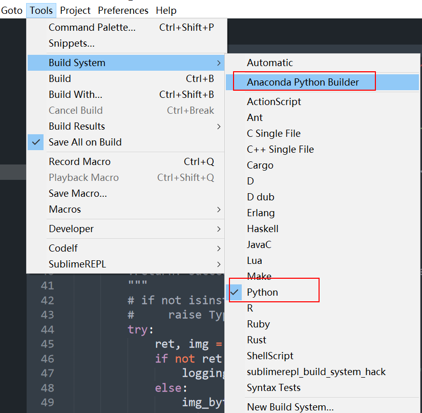
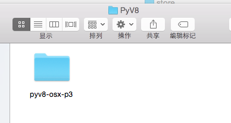

---
jupyter:
  jupytext:
    text_representation:
      extension: .md
      format_name: markdown
      format_version: '1.3'
      jupytext_version: 1.13.8
  kernelspec:
    display_name: Python 3
    language: python
    name: python3
---

<!-- #region -->
<!-- # Sublime Text3 配置 -->

Sublime 相对其他编辑器轻便、可扩展性强，你可以用来写任何语言的程序。我使用它的主要原因是内存占用少，相当的少，秒启动，面板布局配上丰富的主题不输任一款编辑器，真可谓居家旅行必备良品。

## 一、安装

1. Sublime Texe3 下载地址：http://www.sublimetext.com/3

2. 使用文档
   - [官方文档](http://www.sublimetext.com/docs/3/)
   - [非官方文档](https://sublime-text-unofficial-documentation.readthedocs.io/en/latest/)

## 激活步骤

**修改host文件**

- windows系统：C:\Windows\System32\drivers\etc\hosts
- linux/Mac系统：/etc/hosts

**添加以下内容**
```
# 屏蔽联网验证
127.0.0.1    www.sublimetext.com
127.0.0.1    sublimetext.com
127.0.0.1    sublimehq.com
0.0.0.0     license.sublimehq.com
```

**填写注册码**：
```
ZYNGA INC.
50 User License
EA7E-811825
927BA117 84C9300F 4A0CCBC4 34A56B44
985E4562 59F2B63B CCCFF92F 0E646B83
0FD6487D 1507AE29 9CC4F9F5 0A6F32E3
0343D868 C18E2CD5 27641A71 25475648
309705B3 E468DDC4 1B766A18 7952D28C
E627DDBA 960A2153 69A2D98A C87C0607
45DC6049 8C04EC29 D18DFA40 442C680B
1342224D 44D90641 33A3B9F2 46AADB8F
```

或者

```sh
----- BEGIN LICENSE -----
Member J2TeaM
Single User License
EA7E-1011316
D7DA350E 1B8B0760 972F8B60 F3E64036
B9B4E234 F356F38F 0AD1E3B7 0E9C5FAD
FA0A2ABE 25F65BD8 D51458E5 3923CE80
87428428 79079A01 AA69F319 A1AF29A4
A684C2DC 0B1583D4 19CBD290 217618CD
5653E0A0 BACE3948 BB2EE45E 422D2C87
DD9AF44B 99C49590 D2DBDEE1 75860FD2
8C8BB2AD B2ECE5A4 EFC08AF2 25A9B864
------ END LICENSE ------
```
<!-- #endregion -->

## 二、安装 packageControl

### 在线安装

1. 打开命令面板

    - Win/Linux: ctrl+shift+p
    - Mac: cmd+shift+p
2. 输入`Install Package Control`, 按回车

3. 按下<kbd>ctrl</kbd> + <kbd>~</kbd> 打开console 查看进度，等待几秒，若无错误信息即安装成功。此时就可以在`Preferences`菜单下看到`Package Settings`和`Package Control`两个菜单了。

### 离线安装（推荐）

**可能由于网络原因，或者你安装的比较老的Sublime版本**，无法通过以上方法在线安装，那可以通过以下步骤手动安装 Package Control： 
    1. 点击 `Preferences` > `Browse Packages` 菜单 
    2. 进入打开的目录的上层目录，然后再进入 Installed Packages/目录 
    3.下载[Package Control.sublime-package](https://packagecontrol.io/Package%20Control.sublime-package)并复制到 `Installed Packages/` 目录下
    4.重启 Sublime Text.

参考：https://packagecontrol.io/installation


## 基本设置

### 1. 字体字号主题缩进等等

主题、字体、字号、缩进等

打开 `Preferences –>Settings`(Settings User),在右侧添加如下代码（font_face 及 font_size 可根据个人喜好更改）

```json
{
	"color_scheme": "Packages/Color Scheme - Default/Mariana.sublime-color-scheme",
	"theme": "Adaptive.sublime-theme",
	"font_face": "Consolas",
	"font_size": 13,
	"ignored_packages": ["Vintage"],
	"update_check": false,
	// The number of spaces a tab is considered equal to
	"tab_size": 4,
	// Set to true to insert spaces when tab is pressed
	"translate_tabs_to_spaces": true,
	//设置保存时自动转换
	"expand_tabs_on_save": true
}
```

### 2. 修改注释颜色（同理，可修改任何高亮颜色）

- 安装插件：PackageResourceViewer

- 安装完成后重新打开命令面板，搜索”Package ResourceViewer:Open Resource”

- 搜索“Color Scheme -Default”，搜索你当前使用的主题，在上一步 4.1 基本设置 里可以看到我的是：`Mariana.sublime-color-scheme`.
  （如果你安装过后没有换过主题是不会显示的， 那就先去安装一款喜欢的主题吧 😜）

- 搜索关键字“comment”，按照自己的喜欢修改颜色，可以通过[RGB 颜色查询对照表](https://tool.oschina.net/commons?type=3) 查询，这里修改绿色 #66CD00

```json
{
	"name": "Comment",
	"scope": "comment, punctuation.definition.comment",
	// "foreground": "var(blue6)"
	"foreground": "#66CD00"
}
```

### Windows设置右键 SublimeText 打开

新建 sublime_addright.reg 文件，将其中的路径部分改为自己的安装路径即可

```bat
Windows Registry Editor Version 5.00
[HKEY_CLASSES_ROOT\*\shell\SublimeText3]
@="用 SublimeText3 打开"
"Icon"="D:\\Program Files\\SublimeText3\\sublime_text.exe,0" //改为自己的安装路径

[HKEY_CLASSES_ROOT\*\shell\SublimeText3\command]
@="D:\\Program Files\\SublimeText3\\sublime_text.exe %1" //改为自己的安装路径


[HKEY_CLASSES_ROOT\Directory\shell\SublimeText3]
@="用 SublimeText3 打开"
"Icon"="D:\\Program Files\\SublimeText3\\sublime_text.exe,0" //改为自己的安装路径

[HKEY_CLASSES_ROOT\Directory\shell\SublimeText3\command]
@="D:\\Program Files\\SublimeText3\\sublime_text.exe %1" //改为自己的安装路径
```

<!-- #region -->
## 常用插件

官方插件市场：https://packagecontrol.io/browse  
可以在插件市场查找插件，并预览其功能和使用说明

点击 `Sublime Text -> Preferences -> Package Control`（或者快捷键 `Cmd+Shift+P`）输入**PCI***，然后在输入框里输入插件名，本人常用的插件有以下几个：

- `SideBarEnhancements`:  
SideBarEnhancements 是一款很实用的右键菜单增强插件，有以 diff 形式显示未保存的修改、在文件管理器中显示该文件、复制文件路径、在侧边栏中定位该文件等功能，也有基础的诸如新建文件/目录，编辑，打开/运行，显示，在选择中/上级目录/项目中查找，剪切，复制，粘贴，重命名，删除，刷新等常见功能。
- `FileIcons`:  
文件图标
- `AutoFileName`: 
文件名自动补全，根据路径自动提示该路径下的文件
- `DocBlockr` ：  
    一个真正简单的方式来轻松地创建许多语言包括JavaScript，PHP和CoffeeScript的文档块。只要在函数的上面输入/**，按Tab就可以了。DocBlockr会观察函数需要的变量名和类型，并创建文档块。
- `MarkDownEditing`:  
支持MarkDown语法高亮
- `MarkDownPreview`:  
    按Ctrl + b 会生成html网页，可以预览readme.md文件，在最前面添加[TOC]可以自动生成目录
- `OmniMarkupPreviewer`:  
  使用说明：用来在浏览器中预览 markdown 编辑的效果 快捷键：ctrl+alt+o
- `Alignment`:  
Alignment 是一个代码格式化插件，它可以使多行代码中的等号对齐，也可以调整多行代码为一个缩进级别。
  快捷键：ctrl+shift+alt+a
- `Gitmoji`:  
选择git提交信息图标
- `GitGutter`： 
在侧边栏中显示当前文件的git状态改变（git diff）
- `SublimeREPL`:  
支持各种语言解释器切换，方便我们在编辑器上编写完代码进行调试。
- `ConvertToUTF8`:   
  自动转为 UTF-8 编码类型, 可解决大部分中文乱码问题
- `BracketHighlighter`:  
  使用说明：BracketHighlighter 插件是用来匹配相对的符号，然后高亮显示，比如{ }、[ ]、" "等符号的对应高亮显
- `DeleteBlankLines`:  
  使用说明：选中需要批量删除空行的部分，Ctrl + Alt + Backspace，选中部分的所有空行就都被删除了
  快捷键：ctrl+alt+backspace
- `EditorConfig`:
  代码空格缩进统一插件
  
- `SublimeTmpl`:  
  使用说明：按指定快捷键生成模板。
  快捷键：
  ctrl+alt+h 新建 html 模板文件
  ctrl+alt+j 新建 javascript 模板文件
  ctrl+alt+c 新建 css 模板文件
  ctrl+alt+p 新建 php 模板文件
  ctrl+alt+r 新建 ruby 模板文件
  ctrl+alt+shift+p 新建 python 模板文件
（**注**：插件的配置及快捷键使用请在插件市场里搜索查看）
- `Terminal`:
  调用命令行工具，这里我设置的是 git bash,可在该插件的 setting-user
- `Codelf`:  
下载地址：[Codelf for Sublime Text](https://github.com/unbug/codelf)  
  使用说明：变量命名神器 Codelf 通过搜索在线开源平台的项目源码帮开发者给变量命名 ，有了它再也不用为了命名而绞尽脑汁了
  快捷键：鼠标右键，选择 Codelf
- `SublimeCodeInte`:  
  使用说明：Sublime​Code​Intel 是一个代码提示、补全插件，支持 JavaScript、Mason、XBL、XUL、RHTML、SCSS、Python、HTML、Ruby、Python3、XML、Sass、XSLT、Django、HTML5、Perl、CSS、Twig、Less、Smarty、Node.js、Tcl、TemplateToolkit 和 PHP 等语言，是 Sublime Text 自带代码提示功能的很好扩展。


### Package Control超时解决方法：
 
Preferences > Package Settings > Package Control > Settings - User
添加

```json
"channels":
[
    "http://cst.stu.126.net/u/json/cms/channel_v3.json",
],
```
<!-- #endregion -->

<!-- #region heading_collapsed=true -->
## 三、python 环境搭建

### Anaconda 插件

代码提示等功能，python 开发必备

1. 安装插件 `Anaconda`

2. 修改配置

   - Preferences->Package Settings->Anaconda->Settings Default,修改"python_interpreter"为实际 Python 安装路径

   - Preferences->Package Settings->Anaconda->Settings User，添加如下内容

   ```json
   {
   	"python_interpreter": "D:python37/python.exe",
   	"suppress_word_completions": true,
   	"suppress_explicit_completions": true,
   	"comlete_parameters": true,
   	"swallow_startup_errors": true,
   	"anaconda_linting": false
   }
   ```
   
   在`Tools > Build System > Python` 里能使用系统默认（前提已经配好 python 环境变量）的 python 解释器，安装了 Anaconda 插件的情况下也可以使用`Tools > Build System > Anaconda Python Builder` 来运行 python 文件。


### `DocBlockr_Python`插件

文档生成，类似于Pycharm的文档生成功能


### 自定义运行解释器

根据自己需要定义不同的运行环境，比如使用虚拟环境的解释器，python2、3 版本的切换等。

1. 打开 Tools > Build System > New Build System.

2. 点击 New Build System 后，会生成一个空配置文件，在这个配置文件内覆盖配置信息，本文 python 安装路径为“D:/python37”，（注意区分正反斜杠，请将路径换成 python 实际安装路径），然后按 ctrl+s，将文件保存在默认路径，文件名命名为`Python37.sublime-build`"

3、打开 Tools > Build System，选择新建好的 Python37 即可

```json
{
	"cmd": ["D:/python37/python.exe", "-u", "$file"],
	"file_regex": "^[ ]*File \"(...*?)\", line ([0-9]*)",
	"selector": "source.python"
}
```


### 中文乱码问题

1. 安装插件 ConvertToUTF8，安装方法与上同，可解决大部分中文乱码问题，

2. 如果依然有乱码，可能是由于 Anaconda 插件安装之后会自动生成一个叫“Anaconda Python Builder”的编译系统

为 sublime 读取解释器返回文本的编码不一样，返回的是“cp936”，用 repl 解释器交互返回的是 utf-8，说明是由于编码不一致导致的，打开之前新建的 python37.sublime-build，新增"env": {"PYTHONIOENCODING": "utf-8"},即可解决
<!-- #endregion -->

## 前端环境

### 插件

- `Emmet`: Tab 补全html神器
Emmet绝对的节省时间。您可以轻松快速地编写HTML。但是要注意console里的安装日志检查 pyv8环境是否安装成功，Mac系统需要手动安装PyV8:
    - PyV8安装：[下载PyV8相关文件](https://github.com/emmetio/pyv8-binaries)，查找对应的版本下载，下载好的pyv8后，在st安装所在目录下的installed packages文件夹中新建一个文件名为PyV8的文件夹，把解压的文件放到该文件夹当中。如图：
    
    
    创建一个html文件，输入html:5 按下`Tab`试试
    - [Emmet使用指南](https://scotch.io/tutorials/write-html-crazy-fast-with-emmet-an-interactive-guide)
    - [Emmet 插件使用方法总结](http://www.cnblogs.com/jesse131/p/4978966.html)
- `Goto-CSS-Declaration`：即时追踪CSS样式
- `Colorpicker`:  取色器，ctrl + shift + c 
- `HTML-CSS-JS Prettify`:（依赖 Node.js) 格式化html文件 (Ctrl + Shift + H)
- `LESS`: 使用说明：支持 less 语法高亮
- `Pretty Json`: json 格式化插件，使用方法：ctrl + shift + j
- `JsFormat`: JS格式化插件
使用方法：即可在JS文件中通过鼠标右键->JsFormat或键盘快捷键 ctrl + alt + f 对JS进行格式化
- `TrailingSpaces`: 高亮显示多余的空格和Tab
- `jQuery`: 支持jQuery规范的插件包
- `css3`

- `Compact​Expand​Css`:
  使用说明：css 横竖向排列切换
  快捷键：
  ctrl+alt+ [ 横向排列
  ctrl+alt +] 竖向排列
- `Vue Syntax Highlight`
  支持 Vue 语法高亮显示插
- `SublimeLinter-eslint`:
  使用说明：对不符合规则 js 代码进行提示
- `View In Browser`:
  使用说明：sublime 以本地服务器方式打开网页 为了使用插件，你需要建立一个 sublime-project 文件，点击 Project->Edit Project 粘贴以下代码(这是我的相关配置),并保存到 user 目录下
  ```json
{
    "folders":
    [
        {
            "path": "D:\\wamp\\www"
        }
    ],
    "settings":
    {
        "sublime-view-in-browser":
        {
            "baseUrl": "http://localhost"
            "basePath": "D:\\wamp\\www",   //本地虚拟主机根目录
        }
    }
}
```
- `SublimeLinter`:  
  使用说明：它可以帮你找出错误或编写不规范的代码 需要安装 nodejs,jshint,csslint


## 附：Sublime Text 3 快捷键精华版

- Ctrl+Shift+P：打开命令面板
- Ctrl+P：搜索项目中的文件
- Ctrl+G：跳转到第几行
- Ctrl+W：关闭当前打开文件
- Ctrl+Shift+W：关闭所有打开文件
- Ctrl+Shift+V：粘贴并格式化
- Ctrl+D：选择单词，重复可增加选择下一个相同的单词
- Ctrl+L：选择行，重复可依次增加选择下一行
- Ctrl+Shift+L：选择多行
- Ctrl+Shift+Enter：在当前行前插入新行
- Ctrl+X：删除当前行
- Ctrl+M：跳转到对应括号
- Ctrl+U：软撤销，撤销光标位置
- Ctrl+J：选择标签内容
- Ctrl+F：查找内容
- Ctrl+Shift+F：查找并替换
- Ctrl+H：替换
- Ctrl+R：前往 method
- Ctrl+N：新建窗口
- Ctrl+K+B：开关侧栏
- Ctrl+Shift+M：选中当前括号内容，重复可选着括号本身
- Ctrl+F2：设置/删除标记
- Ctrl+/：注释当前行
- Ctrl+Shift+/：当前位置插入注释
- Ctrl+Alt+/：块注释，并 Focus 到首行，写注释说明用的
- Ctrl+Shift+A：选择当前标签前后，修改标签用的
- F11：全屏
- Shift+F11：全屏免打扰模式，只编辑当前文件
- Alt+F3：选择所有相同的词
- Alt+.：闭合标签
- Alt+Shift+数字：分屏显示
- Alt+数字：切换打开第 N 个文件
- Shift+右键拖动：光标多不，- - 用来更改或插入列内容
  鼠标的前进后退键可切换 Tab 文件
  按 Ctrl，依次点击或选取，可需要编辑的多个位置
  按 Ctrl+Shift+上下键，可替换行

选择类

- Ctrl+D 选中光标所占的文本，继续操作则会选中下一个相同的文本。
- Alt+F3 选中文本按下快捷键，即可一次性选择全部的相同文本进行同时编辑。举个栗子：快速选中并更改所有相同的变量名、函数名等。
- Ctrl+L 选中整行，继续操作则继续选择下一行，效果和 Shift+↓ 效果一样。
- Ctrl+Shift+L 先选中多行，再按下快捷键，会在每行行尾插入光标，即可同时编辑这些行。
- Ctrl+Shift+M 选择括号内的内容（继续选择父括号）。举个栗子：快速选中删除函数中的代码，重写函数体代码或重写括号内里的内容。
- Ctrl+M 光标移动至括号内结束或开始的位置。
- Ctrl+Enter 在下一行插入新行。举个栗子：即使光标不在行尾，也能快速向下插入一行。
- Ctrl+Shift+Enter 在上一行插入新行。举个栗子：即使光标不在行首，也能快速向上插入一行。
- Ctrl+Shift+[ 选中代码，按下快捷键，折叠代码。
- Ctrl+Shift+] 选中代码，按下快捷键，展开代码。
- Ctrl+K+0 展开所有折叠代码。
- Ctrl+← 向左单位性地移动光标，快速移动光标。
- Ctrl+→ 向右单位性地移动光标，快速移动光标。
- shift+↑ 向上选中多行。
- shift+↓ 向下选中多行。
- Shift+← 向左选中文本。
- Shift+→ 向右选中文本。
- Ctrl+Shift+← 向左单位性地选中文本。
- Ctrl+Shift+→ 向右单位性地选中文本。
- Ctrl+Shift+↑ 将光标所在行和上一行代码互换（将光标所在行插入到上一行之前）。
- Ctrl+Shift+↓ 将光标所在行和下一行代码互换（将光标所在行插入到下一行之后）。
- Ctrl+Alt+↑ 向上添加多行光标，可同时编辑多行。
- Ctrl+Alt+↓ 向下添加多行光标，可同时编辑多行

编辑类

- Ctrl+J 合并选中的多行代码为一行。举个栗子：将多行格式的 CSS 属性合并为一行。
- Ctrl+Shift+D 复制光标所在整行，插入到下一行。
- Tab 向右缩进。
- Shift+Tab 向左缩进。
- Ctrl+K+K 从光标处开始删除代码至行尾。
- Ctrl+Shift+K 删除整行。
- Ctrl+/ 注释单行。
- Ctrl+Shift+/ 注释多行。
- Ctrl+K+U 转换大写。
- Ctrl+K+L 转换小写。
- Ctrl+Z 撤销。
- Ctrl+Y 恢复撤销。
- Ctrl+U 软撤销，感觉和 Gtrl+Z 一样。
- Ctrl+F2 设置书签
- Ctrl+T 左右字母互换。
- F6 单词检测拼写

搜索类

- Ctrl+F 打开底部搜索框，查找关键字。
- Ctrl+shift+F 在文件夹内查找，与普通编辑器不同的地方是 sublime 允许添加多个文件夹进行查找，略高端，未研究。
- Ctrl+P 打开搜索框。举个栗子：1、输入当前项目中的文件名，快速搜索文件，2、输入@和关键字，查找文件中函数名，3、输入：和数字，跳转到文件中该行代码，4、输入#和关键字，查找变量名。
- Ctrl+G 打开搜索框，自动带：，输入数字跳转到该行代码。举个栗子：在页面代码比较长的文件中快速定位。
- Ctrl+R 打开搜索框，自动带@，输入关键字，查找文件中的函数名。举个栗子：在函数较多的页面快速查找某个函数。
- Ctrl+： 打开搜索框，自动带#，输入关键字，查找文件中的变量名、属性名等。
- Ctrl+Shift+P 打开命令框。场景栗子：打开命名框，输入关键字，调用 sublime text 或插件的功能，例如使用 package 安装插件。
- Esc 退出光标多行选择，退出搜索框，命令框等。

显示类

- Ctrl+Tab 按文件浏览过的顺序，切换当前窗口的标签页。
- Ctrl+PageDown 向左切换当前窗口的标签页。
- Ctrl+PageUp 向右切换当前窗口的标签页。
- Alt+Shift+1 窗口分屏，恢复默认 1 屏（非小键盘的数字）
- Alt+Shift+2 左右分屏-2 列
- Alt+Shift+3 左右分屏-3 列
- Alt+Shift+4 左右分屏-4 列
- Alt+Shift+5 等分 4 屏
- Alt+Shift+8 垂直分屏-2 屏
- Alt+Shift+9 垂直分屏-3 屏
- Ctrl+K+B 开启/关闭侧边栏。
- F11 全屏模式
- Shift+F11 免打扰模式

参考：

- <https://blog.csdn.net/samenmoer/article/details/89740271>
- https://github.com/Jesse121/SublimeText3

```python

```
