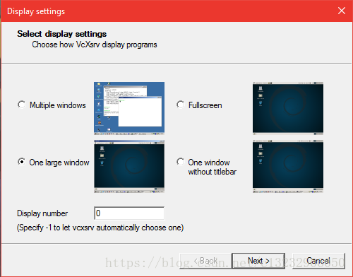

参考：
- [WSL搭建Java开发环境](https://blog.csdn.net/c13232906050/article/details/83025020?depth_1-utm_source=distribute.pc_relevant.none-task&utm_source=distribute.pc_relevant.none-task)
- [Windows Subsystem for Linux入门：安装+配置图形界面+中文环境+工作环境（vscode](https://blog.csdn.net/w_weilan/article/details/82862913?depth_1-utm_source=distribute.pc_relevant.none-task&utm_source=distribute.pc_relevant.none-task)


相对于虚拟机的优势
===

相比于VMware等虚拟机，WSL占用内存和CPU资源更少，在WSL上运行软件的消耗和直接在Windows上差不多。而且，Windows下可以直接访问WSL的环境。

安装 WSL Ubuntu 18.04
===================

安装按着的官方文档来：

- [WSL 1](https://docs.microsoft.com/zh-cn/windows/wsl/about)
- [WSL 2](https://docs.microsoft.com/zh-cn/windows/wsl/wsl2-index)


**注意**wsl2需要Insider Previe版本，个人在更新版本的时候因为杀毒软件的原因在重启的时候会绿屏报“PAGE_FAULT_IN_NONPAGED_AREA”，错误代码0xc1900101，引以为戒。


linux发行版选择了Ubuntu 18.04LTS，MIcrosoft Store还有其他发行版可供选择。这里没有的发行版可以自行折腾（如Arch ）。

可以在Microsoft Store中安装**Windows Terminal**，可以快速打开wsl的终端。

# 修改apt源，加快下载速度（选）

## 1. 查看 Linux 版本

```sh
$ lsb_release -a
 
Distributor ID: Ubuntu
Description:    Ubuntu 18.04.3 LTS
Release:        18.04
Codename:       bionic
```

注意：Codename 为**bionic**

当前 Ubuntu 的版本为 Bionic Beaver（仿生海狸）

## 备份数据源

```sh
$ sudo cp /etc/apt/sources.list /etc/apt/sources-backup.list
```

## 编辑sources.list

```sh
$ sudo vim /etc/apt/sources.list
```

## 更换 sources.list 内容

**阿里源**

以下配置可能略有不同，原则上是将所有deb和deb-src后面的地址都替换为一样的即可。

```
deb http://mirrors.aliyun.com/ubuntu/ bionic main restricted universe multiverse
deb http://mirrors.aliyun.com/ubuntu/ bionic-security main restricted universe multiverse
deb http://mirrors.aliyun.com/ubuntu/ bionic-updates main restricted universe multiverse
deb http://mirrors.aliyun.com/ubuntu/ bionic-proposed main restricted universe multiverse
deb http://mirrors.aliyun.com/ubuntu/ bionic-backports main restricted universe multiverse
deb-src http://mirrors.aliyun.com/ubuntu/ bionic main restricted universe multiverse
deb-src http://mirrors.aliyun.com/ubuntu/ bionic-security main restricted universe multiverse
deb-src http://mirrors.aliyun.com/ubuntu/ bionic-updates main restricted universe multiverse
deb-src http://mirrors.aliyun.com/ubuntu/ bionic-proposed main restricted universe multiverse
deb-src http://mirrors.aliyun.com/ubuntu/ bionic-backports main restricted universe multiverse
```

**163 源**

<http://mirrors.163.com/ubuntu/>

**中科大源**

<https://mirrors.ustc.edu.cn/ubuntu/>

## 更新源


```sh
$ sudo apt-get update
$ sudo apt-get upgrade
```
* * *

Install xfce desktop
====================

注：直接安装整个`xfce4`桌面来安装所需的图形界面组件（idea，eclipse 等需要图形界面，或者自己单独安装需要的组件）

```sh
apt install xfce4
```

* * *

Specify the display server
==========================

在`~/.bashrc`添加

```
export DISPLAY=:0.0
export LIBGL_ALWAYS_INDIRECT=1
```

* * *

Install VcXsrv
==============

Install the lastest version of [VcXsrv](https://sourceforge.net/projects/vcxsrv/).

* * *

Open display server
===================

Open **XLaunch**, choose “One large window” or “One large window without titlebar” and set the “display number” to 0.  
Other settings leave as default and finish the configuration.



* * *

Run xfce desktop
================

运行`bash`

```
startxfce4
```

* * *

Fix powerline fonts rendering（选）
================================

Install the lastest version of [Hack](https://github.com/source-foundry/Hack#linux) fonts.

* * *

Fix Unicode fonts rendering（选）
==============================

```sh
sudo apt-get install fonts-noto
sudo apt-get install fonts-noto-hinted
sudo apt-get install fonts-noto-mono
sudo apt-get install fonts-noto-unhinted
```

* * *

Fix Chinese fonts rendering（选）
==============================

```sh
sudo apt-get install fonts-noto-cjk
```

* * *

Install Chinese input method（选）
===============================

1.Install fcitx
---------------

```sh
sudo apt-get install fcitx
sudo apt-get install fcitx-pinyin
```

2.Add the following command to your bashrc file
-----------------------------------------------

在`~/.bashrc`添加

```sh
export XMODIFIERS=@im=fcitx
export GTK_IM_MODULE=fcitx
export QT_IM_MODULE=fcitx
```
* * *

安装开发软件
======

Python
---
```sh
sudo apt install python python3 python-pip python3-pip
#更换国内pip源
mkdir ~/pip
vim pip.conf

[global]
timeout = 6000
index-url = https://pypi.mirrors.ustc.edu.cn/simple
trusted-host = pypi.mirrors.ustc.edu.cn
```

安装 Java
-------

简单起见，直接`apt install openjdk-8-jdk`  
或用 [Oracle 的 jdk](https://www.oracle.com/technetwork/java/javase/downloads/jdk8-downloads-2133151.html)

安装 idea
-------

[下载解压](https://www.jetbrains.com/idea/download/#section=linux)

方便启动，加入到 PATH

```sh
# idea
export IDEA_HOME=/opt/idea
export PATH=$IDEA_HOME/bin:$PATH
```

安装 dbeaver
----------

[下载解压](https://dbeaver.io/download/)

方便启动，加入到 PATH

```sh
# dbeaver
export DBEAVER_HOME=/opt/dbeaver/current
export PATH=$DBEAVER_HOME:$PATH
```

安装 RedisDesktopManager
----------------------

**完整版（给个 star）：**[**RedisDesktopManager-Linux-WSL**](https://github.com/archongum/RedisDesktopManager-Linux-WSL)

```
# need to upgrade
apt update && apt upgrade

# change to latest tag
git clone --recursive https://github.com/uglide/RedisDesktopManager.git -b 0.9.8

cd RedisDesktopManager/
cd src/
./configure
qmake
make
make install

cd /opt/redis-desktop-manager/
mv qt.conf qt.backup

# optional, reduces rdm size 30MB+ to 2MB+
strip rdm
```

方便启动，加入到 PATH

```
# RDM
export RDM_HOME=/opt/redis-desktop-manager
export PATH=$RDM_HOME:$PATH
```
其他
==

汇总需要添加到. bashrc
---------------

```sh
export DISPLAY=:0.0
export LIBGL_ALWAYS_INDIRECT=1

#pinyin
export XMODIFIERS=@im=fcitx
export GTK_IM_MODULE=fcitx
export QT_IM_MODULE=fcitx

# dbeaver
export DBEAVER_HOME=/opt/dbeaver/current
export PATH=$DBEAVER_HOME:$PATH

# idea
export IDEA_HOME=/opt/idea/current
export PATH=$IDEA_HOME/bin:$PATH

# RDM
export RDM_HOME=/opt/redis-desktop-manager
export PATH=$RDM_HOME:$PATH
```

TheFuck
---

```sh
pip install thefuck
```

Git 修改信息和记住密码
-------------

```sh
git config --global user.name archon
git config --global user.email qq349074225@live.com
git config --global credential.helper store
```

安装字体
----

1.  复制字体到`/usr/share/fonts/${自己新建的目录}`
2.  运行`fc-cache -f -v`
3.  参考 [link1](https://github.com/source-foundry/Hack#linux), [link2](https://blog.csdn.net/bitcarmanlee/article/details/79729634)

alias
---

```sh
cp /mnt/e/.bashrc ~/
或
vim .bashrc
```

```sh
alias p='cd ..'
alias b='cd -'
alias e='cd /mnt/e'
alias city='cd /mnt/c/Users/City/Desktop'
alias work='cd /mnt/e/Workspace'
alias py='cd /mnt/e/Workspace/py'
alias cpp='cd /mnt/e/Workspace/c++'
alias c='clear'  # =左右不能有空格
alias x='startxfce4'
alias ip='ifconfig'
alias py3='python3'
alias tar='tar -zxvf'
```

参考文档
====

[RedisDesktopManager-Linux-WSL](https://github.com/archongum/RedisDesktopManager-Linux-WSL)  
[wsl-tutorial](https://github.com/QMonkey/wsl-tutorial)  
[redisdesktop linux](http://docs.redisdesktop.com/en/latest/install/#ubuntu-debian-fedora-centos-opensuse-archlinux-other-linux-di)  
[redisdesktop build fail](https://github.com/uglide/RedisDesktopManager/issues/4118)
