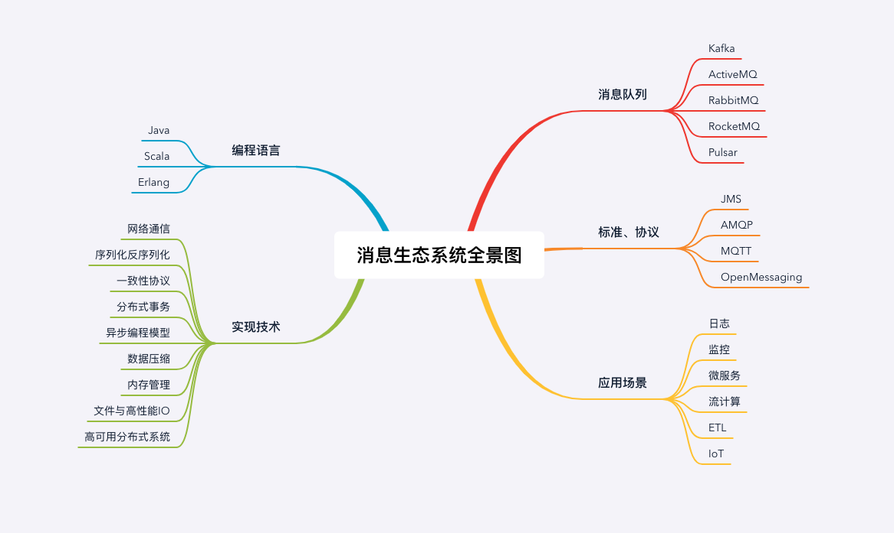

# 预习 | 怎样更好地学习这门课？

## 哪些人适合学消息队列？

**后端开发者**：消息队列几乎是每个后端程序员都会用到的中间件，无论你是开发微服务，实时计算，还是机器学习程序，都需要解决进程间通信的问题。

**渴望技术提升的开发者**：消息队列所涉及的高性能通信、海量数据存储、高并发这些底层的技术比较全面，并且功能简洁、结构清晰，容易入门但又同时具有足够的深度，非常适合用来深入分析和学习底层技术，帮助你实现从用“轮子”到造“轮子”的技术提升。

## 学习消息队列，有哪些门槛？

至少熟练掌握一门编程语言，掌握所有程序员都需要具备的一些基础技术知识和能力，例如：

- 熟练使用各种常用集合，比如：数组、链表、字典等；
- 掌握 Linux 系统的基础知识，会使用常用的命令；
- 具备多线程、并发控制编程能力；
- 编写过读写文件、通过网络收发数据的程序；
- 能看懂最基本的 UML 图，包括类图、时序图等；
- 了解最常用的几种设计模式和算法。

以下内容是一些“加分项”

**1. 英文的阅读能力**

因为整个技术圈大部分的技术类资料、开源软件的文档、代码的注释和论文都是用英文撰写的

**2. 掌握 Java 语言和其生态系统**

大部分服务端的开源软件，包括我们这个课程涉及的 RocketMQ、Kafka、Pulsar 等，都是使用 Java 语言开发的。

Java 强大的生态系统在短时间内还是难以替代的。

**3. 积极的学习态度**

你是不是会认真地思考每一个细节是否已经做到最优？

有没有为使用到的每个集合，仔细考虑到底是用数组，还是链表，还是其他哪种数据结构更合适？

你有多少次迫于项目进度的压力而交出“算了，虽然我知道这么做不好，但也能凑合用”的代码？

你有没有过为自己的某个（哪怕是自认为）绝妙设计，而成就感满满，幸福好几天的时刻？你会不会因为沟通时别人提到了一个你不知道的技术名词感到焦虑和羞愧，然后赶紧偷偷学习补齐这个技术短板？

**只有发自内心的对技术的热爱，才是保证持续学习并且不断提升自己的唯一动力。**

## 由浅入深学习消息队列

在我看来，要想学好消息队列，不应该仅仅停留在使用层面上，还需要深入了解它的**设计思路、实现原理和使用的底层技术**。但是要注意循序渐进，由浅入深地去学习。

第一步就是去了解消息的基本概念，比如主题、订阅、分区等。

有了这些基础知识的储备以后，你就可以深入到源码中去，进而加深你对消息队列的理解，提升你的技术深度了。这时候你要了解其中必备的底层技术，比如**高性能的网络传输、内存管理和锁的使用**；同时也要深入学习消息队列一些高级特性的实现原理，比如**如何实现事务消息**、消息队列如何支撑**海量 IoT 设备同时在线**。

## 一份知识图谱

我整理了一张 **“消息队列生态全景图”，涵盖了消息队列产品、标准和协议、应用场景、编程语言以及实现技术，**希望可以帮助你对整个消息队列生态系统有宏观的了解和认知。

我们一起来大概浏览一下图中涉及的内容，首先我们来看看消息队列的产品、标准和协议，以及应用场景的部分。

**消息队列产品：**

目前，市面上有的消息队列产品很多，像 Kafka、ActiveMQ、RocketMQ、Pulsar、RabbitMQ 等等，其中比较主流的开源消息队列为 Kafka、RocketMQ 和 RabbitMQ。当然你**并不需要把每个消息队列都去学习一遍，因为这些消息队列中很多的原理和知识都共通的。**

**协议和标准：**

与消息队列相关的协议和标准有 JMS、AMQP、MQTT 和 OpenMessaging。不过，目前为止还没有哪个标准或者协议能“一统江湖”，你做一个**大概的了解即可**，如果需要用到的时候再深入学习也来得及。

**编程语言和技术要点：**

消息队列涉及到的语言有 Java、Scala 和 Erlang。鉴于语言的相通性，只需要关注其中的**设计思想、实现原理和实践方法**这些技术本身的东西。

**实现技术：**

像网络通信、序列化反序列化、分布式事务、内存管理等，这部分内容是这门课程中的精粹，需要你重点学习，也是各种高级研发职位面试题中经常会被问到的内容。

## 学习资源推荐

第三方教程文档会过时，而官方文档总能保持与当前版本同步更新。

> RocketMQ 官方文档： https://rocketmq.apache.org/docs/quick-start/

> RocketMQ 中国开发者中心：http://rocketmq.cloud/zh-cn/

> Kafka 官方文档： http://kafka.apache.org/documentation/

> RabbitMQ 官方文档： https://www.rabbitmq.com/documentation.html

在使用消息队列的过程中，如果遇到问题，要善用搜索引擎，我推荐你首选 Google，次之是 Stack Overflow，相对而言，这些搜索引擎搜索到有价值信息的概率会更高一些。

> Stack Overflow：https://stackoverflow.com/