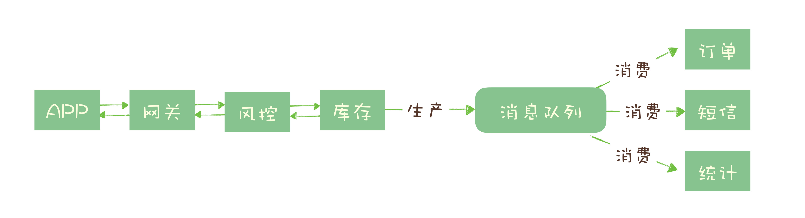
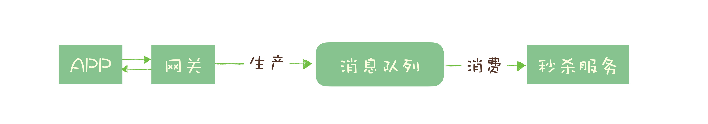

# 01 | 为什么需要消息队列？

我们知道，消息队列的主要功能就是收发消息，但是它的作用不仅仅只是解决应用之间的通信问题这么简单。

我们举个例子说明一下消息队列的作用。

话说小袁是一家巧克力作坊的老板，生产出美味的巧克力需要三道工序：首先将可可豆磨成可可粉，然后将可可粉加热并加入糖变成巧克力浆，最后将巧克力浆灌入模具，撒上坚果碎，冷却后就是成品巧克力了。

最开始的时候，每次研磨出一桶可可粉后，工人就会把这桶可可粉送到加工巧克力浆的工人手上，然后再回来加工下一桶可可粉。小袁很快就发现，其实工人可以不用自己运送半成品，于是他在每道工序之间都增加了一组传送带，研磨工人只要把研磨好的可可粉放到传送带上，就可以去加工下一桶可可粉了。 

**传送带解决了上下游工序之间的“通信”问题。**

传送带上线后确实提高了生产效率，但也带来了新的问题：每道工序的生产速度并不相同。在巧克力浆车间，一桶可可粉传送过来时，工人可能正在加工上一批可可粉，没有时间接收。不同工序的工人们必须协调好什么时间往传送带上放置半成品，如果出现上下游工序加工速度不一致的情况，上下游工人之间必须互相等待，确保不会出现传送带上的半成品无人接收的情况。

为了解决这个问题，小袁在每组传送的下游带配备了一个暂存半成品的仓库，这样上游工人就不用等待下游工人有空，任何时间都可以把加工完成的半成品丢到传送带上，无法接收的货物被暂存在仓库中，下游工人可以随时来取。

**传送带配备的仓库实际上起到了“通信”过程中“缓存”的作用。**

传送带解决了半成品运输问题，仓库可以暂存一些半成品，解决了上下游生产速度不一致的问题，小袁在不知不觉中实现了一个巧克力工厂版的消息队列。

## 哪些问题适合使用消息队列来解决？

### 1. 异步处理

大多数程序员在面试中，应该都问过或被问过一个经典却没有标准答案的问题：**如何设计一个秒杀系统？**这个问题可以有一百个版本的合理答案，但**大多数答案中都离不开消息队列。**

秒杀系统需要解决的核心问题是，如何利用有限的服务器资源，尽可能多地处理短时间内的海量请求。我们知道，处理一个秒杀请求包含了很多步骤，例如：

- 风险控制；
- 库存锁定；
- 生成订单；
- 短信通知；
- 更新统计数据。

如果没有任何优化，正常的处理流程是：App 将请求发送给网关，依次调用上述 5 个流程，然后将结果返回给 APP。

对于对于这 5 个步骤来说，能否决定秒杀成功，实际上只有风险控制和库存锁定这 2 个步骤。只要用户的秒杀请求通过风险控制，并在服务端完成库存锁定，就可以给用户返回秒杀结果了，对于后续的生成订单、短信通知和更新统计数据等步骤，并不一定要在秒杀请求中处理完成。

所以当服务端完成前面 2 个步骤，确定本次请求的秒杀结果后，就可以马上给用户返回响应，然后把请求的数据放入消息队列中，由消息队列异步地进行后续的操作。

处理一个秒杀请求，**从 5 个步骤减少为 2 个步骤**，这样不仅响应速度更快，并且在秒杀期间，我们可以把大量的服务器资源用来处理秒杀请求。秒杀结束后再把资源用于处理后面的步骤，充分利用有限的服务器资源处理更多的秒杀请求。

**可以看到，在这个场景中，消息队列被用于实现服务的异步处理。**

**这样做的好处是：**

- 可以更快地返回结果；
- 减少等待，自然实现了步骤之间的并发，提升系统总体的性能。

### 2. 流量控制

继续说我们的秒杀系统，我们已经使用消息队列实现了部分工作的异步处理，但我们还面临一个问题：**如何避免过多的请求压垮我们的秒杀系统？**

一个设计健壮的程序有自我保护的能力，在海量的请求下，在自身能力范围内尽可能多地处理请求，**拒绝处理不了的请求并且保证自身运行正常**，而直接拒绝请求返回错误对于用户来说也是不怎么好的体验。因此，我们需要设计一套足够健壮的架构来将后端的服务保护起来。

**我们的设计思路是：使用消息队列隔离网关和后端服务，以达到流量控制和保护后端服务的目的。**

加入消息队列后，整个秒杀流程变为：

1. 网关在收到请求后，将请求放入请求消息队列；

2. 后端服务从请求消0息队列中获取 APP 请求，完成后续秒杀处理过程，然后返回结果。

   

秒杀开始后，当短时间内大量的秒杀请求到达网关时，不会直接冲击到后端的秒杀服务，而是先堆积在消息队列中，后端服务按照自己的最大处理能力，从消息队列中消费请求进行处理。

对于**超时的请求可以直接丢弃**，APP 将超时无响应的请求处理为秒杀失败即可。

运维人员还可以随时增加秒杀服务的**实例数量进行水平扩容**，而不用对系统的其他部分做任何更改。

**这种设计的优点是：**

能根据下游的处理能力自动调节流量，达到“**削峰填谷**”的作用。

但这样做同样是有**代价**的：

- 增加了系统调用链环节，导致总体的响应时延变长。
- 上下游系统都要将同步调用改为异步消息，增加了系统的复杂度。

那还有没有更简单一点儿的流量控制方法呢？

如果我们能预估出秒杀服务的处理能力，就可以用消息队列实现一个令牌桶，更简单地进行流量控制。

**令牌桶控制流量的原理是**：单位时间内只发放固定数量的令牌到令牌桶中，规定服务在处理请求之前必须先从令牌桶中拿出一个令牌，如果令牌桶中没有令牌，则拒绝请求。这样就保证单位时间内，能处理的请求不超过发放令牌的数量，起到了流量控制的作用。

实现的方式也很简单，**不需要破坏原有的调用链，只要网关在处理 APP 请求时增加一个获取令牌的逻辑。**

令牌桶可以简单地用一个**有固定容量的消息队列加一个“令牌发生器”**来实现：令牌发生器按照预估的处理能力，匀速生产令牌并放入令牌队列（如果队列满了则丢弃令牌），网关在收到请求时去令牌队列消费一个令牌，获取到令牌则继续调用后端秒杀服务，如果获取不到令牌则直接返回秒杀失败。

以上是常用的使用消息队列两种进行流量控制的设计方法，你可以根据各自的优缺点和不同的适用场景进行合理选择。

### 3. 服务解耦

消息队列的另外一个作用，就是实现系统应用之间的解耦。再举一个电商的例子来说明解耦的**作用和必要性**。

我们知道订单是电商系统中比较核心的数据，当一个新订单创建时：

1. 支付系统需要发起支付流程；
2. 风控系统需要审核订单的合法性；
3. 客服系统需要给用户发短信告知用户；
4. 经营分析系统需要更新统计数据；
5. ……

这些订单下游的系统都需要实时获得订单数据。随着业务不断发展，这些订单下游系统不断的增加，不断变化，并且每个系统可能只需要订单数据的一个子集，负责订单服务的开发团队不得不花费很大的精力，应对不断增加变化的下游系统，不停地修改调试订单系统与这些下游系统的接口。任何一个下游系统接口变更，都需要订单模块重新进行一次上线，对于一个电商的核心服务来说，这几乎是不可接受的。

所有的电商都选择用消息队列来解决类似的系统耦合过于紧密的问题。引入消息队列后，订单服务在订单变化时发送一条消息到消息队列的一个主题 Order 中，所有下游系统都订阅主题 Order，这样每个下游系统都可以获得一份实时完整的订单数据。

无论增加、减少下游系统或是下游系统需求如何变化，订单服务都无需做任何更改，实现了订单服务与下游服务的解耦。

## 小结

以上就是消息队列最常被使用的三种场景：异步处理、流量控制和服务解耦。当然，消息队列的适用范围不仅仅局限于这些场景，还有包括：

- **作为发布 / 订阅系统实现一个微服务级系统间的观察者模式；**
- **连接流计算任务和数据；**
- **用于将消息广播给大量接收者。**

简单的说，我们在单体应用里面需要用队列解决的问题，在分布式系统中大多都可以用消息队列来解决。

同时我们也要认识到，消息队列也有它自身的一些**问题和局限性**，包括：

- 引入消息队列带来的延迟问题；
- 增加了系统的复杂度；
- 可能产生数据不一致的问题。

所以我们说没有最好的架构，只有最适合的架构，根据目标业务的特点和自身条件选择合适的架构，才是体现一个架构师功力的地方。
