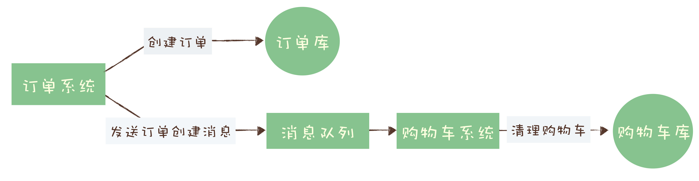
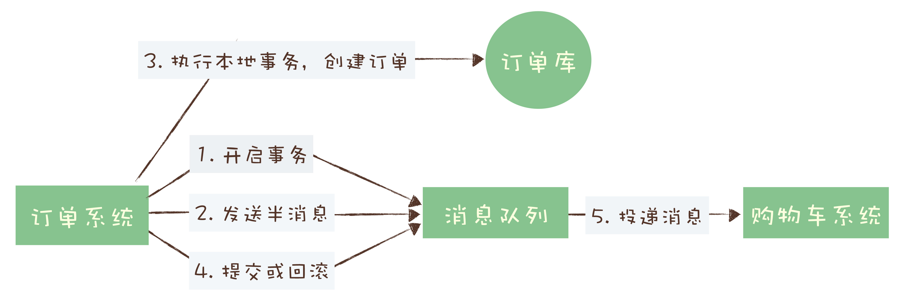
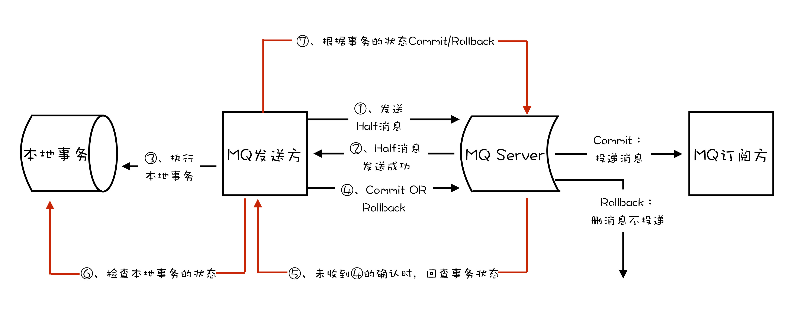

# 04 | 如何利用事务消息实现分布式事务？

**消息队列中的“事务”，主要解决的是消息生产者和消息消费者的数据一致性问题。**

依然拿我们熟悉的电商来举个例子。一般来说，用户在电商 APP 上购物时，先把商品加到购物车里，然后几件商品一起下单，最后支付，完成购物流程，就可以愉快地等待收货了。

这个过程中有一个需要用到消息队列的步骤，订单系统创建订单后，发消息给购物车系统，将已下单的商品从购物车中删除。因为从购物车删除已下单商品这个步骤，并不是用户下单支付这个主要流程中必需的步骤，使用消息队列来异步清理购物车是更加合理的设计。

对于订单系统来说，它创建订单的过程中实际上执行了 2 个步骤的操作：

1. 在订单库中插入一条订单数据，创建订单；
2. 发消息给消息队列，消息的内容就是刚刚创建的订单。

购物车系统订阅相应的主题，接收订单创建的消息，然后清理购物车，在购物车中删除订单中的商品。

在分布式系统中，上面提到的这些步骤，**任何一个步骤都有可能失败**，如果不做任何处理，那就有可能出现订单数据与购物车数据不一致的情况，比如说：

- 创建了订单，没有清理购物车；
- 订单没创建成功，购物车里面的商品却被清掉了。

那我们需要解决的问题可以总结为：**在上述任意步骤都有可能失败的情况下，还要保证订单库和购物车库这两个库的数据一致性。**

对于购物车系统收到订单创建成功消息清理购物车这个操作来说，失败的处理比较简单，只要成功执行购物车清理后再提交**消费确认**即可，如果失败，由于没有提交消费确认，消息队列会自动重试。

问题的关键点集中在订单系统，创建订单和发送消息这两个步骤要么都操作成功，要么都操作失败，不允许一个成功而另一个失败的情况出现。

这就是事务需要解决的问题。

## 什么是分布式事务？

那什么是事务呢？如果我们需要对若干数据进行更新操作，为了保证这些数据的完整性和一致性，我们希望这些更新操作**要么都成功，要么都失败。**至于更新的数据，不只局限于数据库中的数据，可以是磁盘上的一个文件，也可以是远端的一个服务，或者以其他形式存储的数据。

这就是通常我们理解的事务。其实这段对事务的描述不是太准确也不完整，但是，它更易于理解，大体上也是正确的。所以我还是倾向于这样来讲“事务”这个比较抽象的概念。

一个严格意义的事务实现，应该具有 4 个属性：**原子性、一致性、隔离性、持久性**。这四个属性通常称为 ACID 特性。

- 原子性，是指一个事务操作不可分割，要么成功，要么失败，不能有一半成功一半失败的情况。

- 一致性，是指这些数据在事务执行完成这个时间点之前，读到的一定是更新前的数据，之后读到的一定是更新后的数据，不应该存在一个时刻，让用户读到更新过程中的数据。

- 隔离性，是指一个事务的执行不能被其他事务干扰。即一个事务内部的操作及使用的数据对正在进行的其他事务是隔离的，并发执行的各个事务之间不能互相干扰，这个有点儿像我们打网游中的副本，我们在副本中打的怪和掉的装备，与其他副本没有任何关联也不会互相影响。

- 持久性，是指一个事务一旦完成提交，后续的其他操作和故障都不会对事务的结果产生任何影响。

大部分传统的单体关系型数据库都完整的实现了 ACID，但是，**对于分布式系统来说，严格的实现 ACID 这四个特性几乎是不可能的，或者说实现的代价太大，大到我们无法接受。**

分布式事务就是要在分布式系统中的实现事务。在分布式系统中，在保证可用性和不严重牺牲性能的前提下，光是要实现数据的一致性就已经非常困难了，所以出现了很多“残血版”的一致性，比如**顺序一致性、最终一致性**等等。

显然实现严格的分布式事务是更加不可能完成的任务。所以，目前大家所说的分布式事务，更多情况下，是在分布式系统中事务的不完整实现。在不同的应用场景中，有不同的实现，**目的都是通过一些妥协来解决实际问题**。

在实际应用中，比较常见的分布式事务实现有 **2PC（Two-phase Commit，也叫二阶段提交）、TCC(Try-Confirm-Cancel) 和事务消息。**每一种实现都有其特定的使用场景，也有各自的问题，都不是完美的解决方案。

事务消息适用的场景主要是那些需要异步更新数据，并且对数据实时性要求不太高的场景。比如我们在开始时提到的那个例子，在创建订单后，如果出现短暂的几秒，购物车里的商品没有被及时清空，也不是完全不可接受的，只要最终购物车的数据和订单数据保持一致就可以了。

2PC 和 TCC 不是我们本次课程讨论的内容，就不展开讲了，感兴趣的同学可以自行学习。

## 消息队列是如何实现分布式事务的？

事务消息需要消息队列提供相应的功能才能实现，Kafka 和 RocketMQ 都提供了事务相关功能。

回到订单和购物车这个例子，我们一起来看下如何用消息队列来实现分布式事务。

首先，订单系统在消息队列上开启一个事务。然后订单系统给消息服务器发送一个**“半消息”**，这个半消息不是说消息内容不完整，它包含的内容就是完整的消息内容，半消息和普通消息的唯一区别是，**在事务提交之前，对于消费者来说，这个消息是不可见的。**

半消息发送成功后，订单系统就可以执行本地事务了，在订单库中创建一条订单记录，并提交订单库的数据库事务。然后根据本地事务的执行结果决定提交或者回滚事务消息。如果订单创建成功，那就提交事务消息，购物车系统就可以消费到这条消息继续后续的流程。如果订单创建失败，那就回滚事务消息，购物车系统就不会收到这条消息。这样就基本实现了“要么都成功，要么都失败”的一致性要求。

如果你足够细心，可能已经发现了，这个实现过程中，有一个问题是没有解决的。如果在第四步

**提交事务消息时失败了怎么办？**

对于这个问题，Kafka 和 RocketMQ 给出了 2 种不同的解决方案。

**Kafka 的解决方案比较简单粗暴，直接抛出异常，让用户自行处理**。我们可以在业务代码中反复重试提交，直到提交成功，或者删除之前创建的订单进行补偿。RocketMQ 则给出了另外一种解决方案。

## RocketMQ 中的分布式事务实现

在 RocketMQ 中的事务实现中，增加了**事务反查的机制**来解决事务消息提交失败的问题。如果 Producer 也就是订单系统，在提交或者回滚事务消息时发生网络异常，RocketMQ 的 Broker 没有收到提交或者回滚的请求，**Broker 会定期去 Producer 上反查这个事务对应的本地事务的状态，然后根据反查结果决定提交或者回滚这个事务。**

为了支撑这个事务反查机制，我们的业务代码需要实现一个反查本地事务状态的接口，告知 RocketMQ 本地事务是成功还是失败。

在我们这个例子中，反查本地事务的逻辑也很简单，我们只要根据消息中的订单 ID，在订单库中查询这个订单是否存在即可，如果订单存在则返回成功，否则返回失败。RocketMQ 会自动根据事务反查的结果提交或者回滚事务消息。

这个反查本地事务的实现，并不依赖消息的发送方，也就是订单服务的某个实例节点上的任何数据。这种情况下，即使是发送事务消息的那个订单服务节点宕机了，RocketMQ 依然可以通过其他订单服务的节点来执行反查，确保事务的完整性。

综合上面讲的通用事务消息的实现和 RocketMQ 的事务反查机制，使用 RocketMQ 事务消息功能实现分布式事务的流程如下图：

> rocketmq事务消息参考文档：https://rocketmq.apache.org/docs/transaction-example/

> 问题一：为什么先①提交半消息，并且收到②，再③执行本地事务？
>
> 作者回复：考虑这样一种情况：订单创建成功了，还没来得及发消息，这个节点突然断电了。

>问题二：RocketMQ 的这种事务消息是不是完整地 实现了事务的 ACID 四个特性？
>
>评论区大佬回答：
>
>A:本地事务的操作1，与往消息队列中生产消息的操作2，是两个分离的操作，不符合对原子性的定义；
>
>C:由于操作消息队列属于异步操作，在数据一致性上，只能保证数据的最终一致性。若对于时效性要求很高的系统来说，事务消息不是数据一致的；但对于时效性要求不高的系统来说，他就是数据一致的。我认为，用不同的业务视角来看问题，会有不同的答案；
>
>I：隔离性上，由于事物消息是分两步操作的，本地事物提交后，别的事务消息就已经可以看到提交的消息了。所以，不符合隔离性的定义；
>
>D：持久性上，rocketMq上支持事物的反查机制，但我不太清楚“半消息”是存储在磁盘中，还是内存里。若存储在磁盘中，那就支持持久性，即使事物消息提交后，发生服务突然宕机也不受影响；若存储在内存中，则无法保证持久性。

## 小结

我们通过一个订单购物车的例子，学习了事务的 ACID 四个特性，以及如何使用消息队列来实现分布式事务。

然后我们给出了现有的几种分布式事务的解决方案，包括事务消息，但是这几种方案都不能解决分布式系统中的所有问题，每一种方案都有局限性和特定的适用场景。

最后，我们一起学习了 RocketMQ 的事务反查机制，这种机制通过定期反查事务状态，来补偿提交事务消息可能出现的通信失败。在 Kafka 的事务功能中，并没有类似的反查机制，需要用户自行去解决这个问题。

但是，这不代表 RocketMQ 的事务功能比 Kafka 更好，只能说在我们这个例子的场景下，更适合使用 RocketMQ。Kafka 对于事务的定义、实现和适用场景，和 RocketMQ 有比较大的差异，后面的课程中，我们会专门讲到 Kafka 的事务的实现原理。

-------

RocketMQ 实现订单购物车的例子：

1. 首先通过`producer.sendMessageInTransaction()`方法发送一个半消息给MQ

2. 此时会在`TransactionListener`中的`executeLocalTransaction()`方法阻塞，然后在这个方法里面进行订单创建并提交本地事务，如果commit成功，则返回COMMIT状态，否则是ROLLBACK状态，如果正常返回COMMIT或者ROLLBACK的话，不会存在第3步的反查情况。

3. 如果上面的本地事务提交成功以后，此节点突然断电，那么`checkLocalTransaction()`反查方法就会在某个时候被MQ调用，此方法会根据消息中的订单号去数据库确认订单是否存在，存在就返回COMMIT状态，否则是ROLLBACK状态。

4. 购物车在另外一个项目中，反正只要收到MQ的消息就将本次订单的商品从购物车中删除即可。