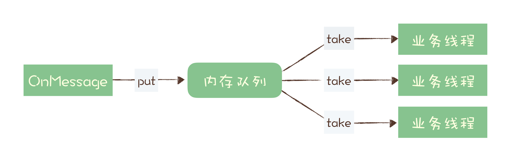

# 07 | 消息积压了该如何处理？

## 优化性能来避免消息积压

在使用消息队列的系统中，对于性能的优化，主要体现在生产者和消费者这一收一发两部分的业务逻辑中。对于消息队列本身的性能，你作为使用者，不需要太关注。为什么这么说呢？

主要原因是，对于绝大多数使用消息队列的业务来说，消息队列本身的处理能力要远大于业务系统的处理能力。主流消息队列的单个节点，消息收发的性能可以达到每秒钟处理几万至几十万条消息的水平，还可以通过水平扩展 Broker 的实例数成倍地提升处理能力。

而一般的业务系统需要处理的业务逻辑远比消息队列要复杂，单个节点每秒钟可以处理几百到几千次请求，已经可以算是性能非常好的了。所以，对于消息队列的性能优化，我们更关注的是，**在消息的收发两端，我们的业务代码怎么和消息队列配合，达到一个最佳的性能。**

#### 1. 发送端性能优化

发送端业务代码的处理性能，实际上和消息队列的关系不大，因为一般发送端都是先执行自己的业务逻辑，最后再发送消息。**如果说，你的代码发送消息的性能上不去，你需要优先检查一下，是不是发消息之前的业务逻辑耗时太多导致的。**

对于发送消息的业务逻辑，只需要注意**设置合适的并发和批量大小**，就可以达到很好的发送性能。为什么这么说呢？

我们之前的课程中讲过 Producer 发送消息的过程，Producer 发消息给 Broker，Broker 收到消息后返回确认响应，这是一次完整的交互。假设这一次交互的平均时延是 1ms，我们把这 1ms 的时间分解开，它包括了下面这些步骤的耗时：

- 发送端准备数据、序列化消息、构造请求等逻辑的时间，也就是发送端在发送网络请求之前的耗时；
- 发送消息和返回响应在网络传输中的耗时；
- Broker 处理消息的时延。

如果是单线程发送，每次只发送 1 条消息，那么每秒只能发送 1000ms / 1ms * 1 条 /ms = 1000 条 消息，这种情况下并不能发挥出消息队列的全部实力。

无论是**增加每次发送消息的批量大小**，还是**增加并发**，都能成倍地提升发送性能。至于到底是选择批量发送还是增加并发，主要取决于发送端程序的业务性质。简单来说，只要能够满足你的性能要求，怎么实现方便就怎么实现。

比如说，你的消息发送端是一个微服务，主要接受 RPC 请求处理在线业务。很自然的，微服务在处理每次请求的时候，就在当前线程直接发送消息就可以了，因为所有 RPC 框架都是多线程支持多并发的，自然也就实现了并行发送消息。并且在线业务比较在意的是请求响应时延，选择批量发送必然会影响 RPC 服务的时延。这种情况，比较明智的方式就是通过并发来提升发送性能。

如果你的系统是一个离线分析系统，离线系统在性能上的需求是什么呢？它不关心时延，更注重整个系统的吞吐量。发送端的数据都是来自于数据库，这种情况就更适合批量发送，你可以批量从数据库读取数据，然后批量来发送消息，同样用少量的并发就可以获得非常高的吞吐量。

#### 2. 消费端性能优化

使用消息队列的时候，大部分的性能问题都出现在消费端，如果消费的速度跟不上发送端生产消息的速度，就会造成消息积压。如果这种性能倒挂的问题只是**暂时的，那问题不大**，只要消费端的性能恢复之后，超过发送端的性能，那积压的消息是可以逐渐被消化掉的。

要是消费速度一直比生产速度慢，时间长了，整个系统就会出现问题，要么，消息队列的存储被填满无法提供服务，要么消息丢失，这对于整个系统来说都是严重故障。

所以，我们在设计系统的时候，**一定要保证消费端的消费性能要高于生产端的发送性能，这样的系统才能健康的持续运行。**

消费端的性能优化除了优化消费业务逻辑以外，也可以通过水平扩容，**增加消费端的并发数**来提升总体的消费性能。特别需要注意的一点是，**在扩容 Consumer 的实例数量的同时，必须同步扩容主题中的分区（也叫队列）数量，确保 Consumer 的实例数和分区数量是相等的。**如果 Consumer 的实例数量超过分区数量，这样的扩容实际上是没有效果的。原因我们之前讲过，因为对于消费者来说，在每个分区上实际上只能支持单线程消费。

我见到过很多消费程序，他们是这样来解决消费慢的问题的：

它收消息处理的业务逻辑可能比较慢，也很难再优化了，为了避免消息积压，在收到消息的 OnMessage 方法中，不处理任何业务逻辑，把这个消息放到一个内存队列里面就返回了。然后它可以启动很多的业务线程，这些业务线程里面是真正处理消息的业务逻辑，这些线程从内存队列里取消息处理，这样它就解决了单个 Consumer 不能并行消费的问题。

这个方法是不是很完美地实现了并发消费？请注意，这是一个非常常见的错误方法！ 为什么错误？因为会丢消息。如果收消息的节点发生宕机，在内存队列中还没来及处理的这些消息就会丢失。关于“消息丢失”问题，你可以回顾一下我们的专栏文章《[05 | 如何确保消息不会丢失？](./05丨如何确保消息不会丢失.md)》。

## 消息积压了该如何处理？

能导致积压突然增加，最粗粒度的原因，只有两种：要么是发送变快了，要么是消费变慢了。

1. 提升消费能力

大部分消息队列都内置了监控的功能，只要通过监控数据，很容易确定是哪种原因。如果是单位时间发送的消息增多，比如说是赶上大促或者抢购，短时间内不太可能优化消费端的代码来提升消费性能，唯一的方法是通过扩容消费端的实例数来提升总体的消费能力。

如果短时间内没有足够的服务器资源进行扩容，没办法的办法是，将系统降级，通过关闭一些不重要的业务，减少发送方发送的数据量，最低限度让系统还能正常运转，服务一些重要业务。

2. 查日志，处理消费异常

还有一种不太常见的情况，你通过监控发现，无论是发送消息的速度还是消费消息的速度和原来都没什么变化，这时候你需要检查一下你的消费端，是不是**消费失败**导致的一条消息反复消费这种情况比较多，这种情况也会拖慢整个系统的消费速度。

如果监控到消费变慢了，你需要检查你的消费实例，分析一下是什么原因导致消费变慢。优先检查一下日志是否有大量的消费错误，如果没有错误的话，可以通过打印堆栈信息，看一下你的消费线程是不是卡在什么地方不动了，比如触发了死锁或者卡在等待某些资源上了。

## 小结

这节课我们主要讨论了 2 个问题，一个是如何在消息队列的收发两端优化系统性能，提前预防消息积压。另外一个问题是，当系统发生消息积压了之后，该如何处理。

优化消息收发性能，预防消息积压的方法有两种，增加批量或者是增加并发，在发送端这两种方法都可以使用，在消费端需要注意的是，增加并发需要同步扩容分区数量，否则是起不到效果的。

对于系统发生消息积压的情况，需要**先解决积压，再分析原因**，毕竟保证系统的可用性是首先要解决的问题。快速解决积压的方法就是通过水平扩容增加 Consumer 的实例数量。

## 思考题

课后请你思考一下，在消费端是否可以通过批量消费的方式来提升消费性能？在什么样场景下，适合使用这种方法？或者说，这种方法有什么局限性？

回答一：如果使用了批量消费的方式，那么就需要批量确认，如果一次消费十条消息，除了第七条消费失败了，其他的都处理成功了，但是这中情况下broker只能将消费的游标修改成消息7，而之后的消息虽然处理成功了，但是也只能使用类似于拉回重传的方式再次消费，浪费性能，而且这种批量消费对于消费者的并发我觉得不是很友好，可能消费者1来了取走了十条消息在处理，这时候消费者2过来了也想取十条消息，但是他需要等待消费者1进行ack才可以取走消息

回答二：消费者批量获取数据，如果是自动ack,那么offset是这一批数据的最大的offset，但是如果业务处理数据失败但是offset已经提交，那么对业务来说这批数据消费是有问题的，还有情况就是重复消费的问题，如果是处理完业务再ack的过程中失败了，那么下次会拉取重复数据，重复数据可以幂等性解决，主要还是看对消息丢失的容忍度

回答三：

批量消费有意义的场景要求：

1. 要么消费端对消息的处理支持批量处理，比如批量入库 

2. 要么消费端支持多线程/协程并发处理，业务上也允许消息无序。
3. 或者网络带宽在考虑因素内，需要减少消息的overhead。

批量消费的局限性：

1. 需要一个整体ack的机制，一旦一条靠前的消息消费失败，可能会引起很多消息重试。
2. 多线程下批量消费速度受限于最慢的那个线程